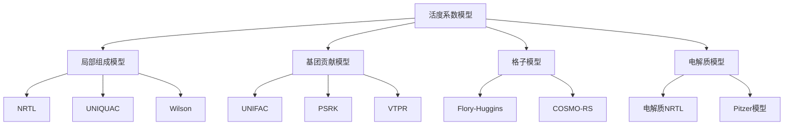
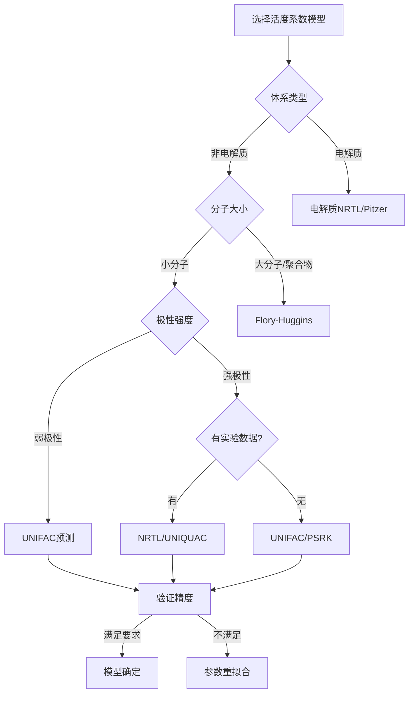

# 活度系数模型技术手册 (增强版)

**文档版本**: 2.0 (增强版)  
**更新日期**: 2024年12月  
**作者**: OpenAspen项目组  
**覆盖范围**: 完整理论、实现细节、工业应用  

---

## 📋 内容导航

1. [理论基础](#理论基础)
2. [局部组成模型](#局部组成模型)
3. [基团贡献法](#基团贡献法)
4. [电解质模型](#电解质模型)
5. [高级混合规则](#高级混合规则)
6. [参数估算方法](#参数估算方法)
7. [工业应用案例](#工业应用案例)
8. [数值实现技巧](#数值实现技巧)

---

## 🔬 理论基础

### 活度系数的物理意义

活度系数 $\gamma_i$ 衡量真实溶液与理想溶液的偏离程度：

$$\mu_i = \mu_i^*(T,P) + RT\ln(x_i\gamma_i)$$

其中：
- $\mu_i$: 组分i的化学势
- $\mu_i^*$: 纯组分i的化学势
- $x_i$: 摩尔分数
- $\gamma_i$: 活度系数

### 热力学关系

**Gibbs-Duhem方程**:
$$\sum_i x_i d\ln\gamma_i = 0 \quad \text{(等温等压)}$$

**超额Gibbs自由能关系**:
$$\ln\gamma_i = \frac{\partial(G^E/RT)}{\partial n_i}\bigg|_{T,P,n_{j \neq i}}$$

**活度系数分类**:



---

## 🏗️ 局部组成模型

### 1. NRTL模型深度解析

#### 基本假设
1. **非随机混合**: 分子i周围分子j的局部摩尔分数 $x_{ji}^{local} \neq x_j$
2. **局部组成**: 引入非随机因子 $\alpha_{ij}$ 描述非随机程度
3. **两流体理论**: 将混合物视为两种局部"流体"

#### 完整数学表达式

**NRTL活度系数**:
$$\ln\gamma_i = \frac{\sum_j x_j\tau_{ji}G_{ji}}{\sum_k x_k G_{ki}} + \sum_j \frac{x_j G_{ij}}{\sum_k x_k G_{kj}}\left(\tau_{ij} - \frac{\sum_m x_m\tau_{mj}G_{mj}}{\sum_k x_k G_{kj}}\right)$$

**参数定义**:
$$\tau_{ij} = \frac{g_{ij} - g_{ii}}{RT} = \frac{\Delta g_{ij}}{RT}$$

$$G_{ij} = \exp(-\alpha_{ij}\tau_{ij})$$

#### 温度依赖性

**完整温度关联**:
$$\tau_{ij}(T) = A_{ij} + \frac{B_{ij}}{T} + C_{ij}\ln T + D_{ij}T + \frac{E_{ij}}{T^2}$$

**简化形式**:
$$\tau_{ij}(T) = A_{ij} + \frac{B_{ij}}{T}$$

#### 非随机参数指导

| 系统类型 | $\alpha_{ij}$ 推荐值 | 物理意义 |
|----------|---------------------|----------|
| **非极性-非极性** | 0.20-0.30 | 弱非随机性 |
| **极性-非极性** | 0.30-0.40 | 中等非随机性 |
| **强极性-非极性** | 0.40-0.47 | 强非随机性 |
| **氢键体系** | 0.10-0.30 | 特殊相互作用 |

#### Python高级实现

```python
class NRTL_Advanced(ActivityCoefficientBase):
    """高级NRTL模型实现"""
    
    def __init__(self, compounds):
        super().__init__(compounds, "NRTL")
        self.temperature_parameters = {}
        self.alpha_parameters = {}
        
    def set_temperature_parameters(self, comp1, comp2, A=0, B=0, C=0, D=0, E=0):
        """设置完整的温度依赖参数"""
        key = f"{comp1}-{comp2}"
        self.temperature_parameters[key] = {
            'A': A, 'B': B, 'C': C, 'D': D, 'E': E
        }
        
    def _calculate_tau(self, comp1_idx, comp2_idx, T):
        """计算温度依赖的τ参数"""
        if comp1_idx == comp2_idx:
            return 0.0
            
        key = f"{self.compounds[comp1_idx]}-{self.compounds[comp2_idx]}"
        params = self.temperature_parameters.get(key)
        
        if params:
            tau = (params['A'] + params['B']/T + params['C']*np.log(T) + 
                   params['D']*T + params['E']/(T**2))
        else:
            # 使用简化估算
            tau = self._estimate_tau(comp1_idx, comp2_idx, T)
            
        return tau
        
    def calculate_activity_coefficients(self, x, T):
        """计算活度系数"""
        n_comp = len(x)
        
        # 计算τ和G矩阵
        tau = np.zeros((n_comp, n_comp))
        G = np.zeros((n_comp, n_comp))
        
        for i in range(n_comp):
            for j in range(n_comp):
                tau[i,j] = self._calculate_tau(i, j, T)
                alpha = self._get_alpha(i, j)
                G[i,j] = np.exp(-alpha * tau[i,j])
                
        # NRTL公式计算
        gamma = np.zeros(n_comp)
        
        for i in range(n_comp):
            # 第一项
            sum1_num = sum(x[j] * tau[j,i] * G[j,i] for j in range(n_comp))
            sum1_den = sum(x[k] * G[k,i] for k in range(n_comp))
            term1 = sum1_num / sum1_den
            
            # 第二项
            term2 = 0.0
            for j in range(n_comp):
                sum2_den = sum(x[k] * G[k,j] for k in range(n_comp))
                sum2_num = sum(x[m] * tau[m,j] * G[m,j] for m in range(n_comp))
                
                term2 += (x[j] * G[i,j] / sum2_den) * (tau[i,j] - sum2_num/sum2_den)
                
            gamma[i] = np.exp(term1 + term2)
            
        return gamma
```

### 2. UNIQUAC模型完整理论

#### 拟化学理论基础

UNIQUAC基于Guggenheim的拟化学理论，将混合过程分解为：

1. **组合贡献** (体积-表面积效应)
2. **残基贡献** (分子间相互作用)

#### 数学表达式

**总活度系数**:
$$\ln\gamma_i = \ln\gamma_i^C + \ln\gamma_i^R$$

**组合项**:
$$\ln\gamma_i^C = \ln\frac{\Phi_i}{x_i} + \frac{z}{2}q_i\ln\frac{\theta_i}{\Phi_i} + l_i - \frac{\Phi_i}{x_i}\sum_j x_j l_j$$

其中：
$$\Phi_i = \frac{r_i x_i}{\sum_j r_j x_j}, \quad \theta_i = \frac{q_i x_i}{\sum_j q_j x_j}$$

$$l_i = \frac{z}{2}(r_i - q_i) - (r_i - 1)$$

**残基项**:
$$\ln\gamma_i^R = q_i\left[1 - \ln\sum_j \theta_j \tau_{ji} - \sum_j \frac{\theta_j \tau_{ij}}{\sum_k \theta_k \tau_{kj}}\right]$$

#### 分子参数计算

**体积参数**: $r_i = \sum_{k} \nu_k^{(i)} R_k$

**表面积参数**: $q_i = \sum_{k} \nu_k^{(i)} Q_k$

其中 $\nu_k^{(i)}$ 是化合物i中基团k的数量。

#### 关键基团参数表

| 基团 | $R_k$ | $Q_k$ | 描述 |
|------|-------|-------|------|
| **CH₃** | 0.9011 | 0.848 | 甲基 |
| **CH₂** | 0.6744 | 0.540 | 亚甲基 |
| **CH** | 0.4469 | 0.228 | 次甲基 |
| **C** | 0.2195 | 0.000 | 季碳 |
| **OH** | 1.0000 | 1.200 | 羟基 |
| **H₂O** | 0.9200 | 1.400 | 水 |
| **CHO** | 0.9980 | 0.948 | 醛基 |
| **COOH** | 1.3013 | 1.224 | 羧基 |

#### 高精度实现

```python
class UNIQUAC_Enhanced(ActivityCoefficientBase):
    """增强型UNIQUAC实现"""
    
    def __init__(self, compounds):
        super().__init__(compounds, "UNIQUAC")
        self.coordination_number = 10.0  # z参数
        self.molecular_parameters = {}
        
    def set_molecular_parameters(self, compound, r, q):
        """设置分子参数"""
        self.molecular_parameters[compound] = {'r': r, 'q': q}
        
    def calculate_from_groups(self, compound, groups):
        """从基团计算分子参数"""
        group_data = self._get_group_parameters()
        
        r = sum(count * group_data[group]['R'] for group, count in groups.items())
        q = sum(count * group_data[group]['Q'] for group, count in groups.items())
        
        self.set_molecular_parameters(compound, r, q)
        return r, q
        
    def calculate_activity_coefficients(self, x, T):
        """UNIQUAC活度系数计算"""
        n_comp = len(x)
        
        # 获取分子参数
        r = np.array([self.molecular_parameters[comp]['r'] for comp in self.compounds])
        q = np.array([self.molecular_parameters[comp]['q'] for comp in self.compounds])
        
        # 计算体积和表面积分数
        phi = r * x / np.sum(r * x)  # 体积分数
        theta = q * x / np.sum(q * x)  # 表面积分数
        
        # 计算l参数
        z = self.coordination_number
        l = z/2 * (r - q) - (r - 1)
        
        # 组合项
        ln_gamma_C = (np.log(phi/x) + z/2 * q * np.log(theta/phi) + 
                      l - phi/x * np.sum(x * l))
        
        # 残基项
        tau = self._calculate_tau_matrix(T)
        
        ln_gamma_R = np.zeros(n_comp)
        for i in range(n_comp):
            sum1 = np.sum(theta * tau[i,:])
            
            sum2 = 0.0
            for j in range(n_comp):
                denom = np.sum(theta * tau[:,j])
                sum2 += theta[j] * tau[i,j] / denom
                
            ln_gamma_R[i] = q[i] * (1 - np.log(sum1) - sum2)
            
        return np.exp(ln_gamma_C + ln_gamma_R)
```

---

## 🧩 基团贡献法

### 1. UNIFAC模型完整体系

#### 基团定义方法

**一级基团** (主基团):
- 决定主要化学性质
- 例：烷基(CH₃, CH₂)、芳香基(ACH)、羟基(OH)

**二级基团** (子基团):
- 考虑环境效应
- 例：CH₃-CH₂ vs CH₃-OH中的CH₃

#### 基团相互作用参数

**对称关系**:
$$a_{mn} = a_{nm}, \quad a_{mm} = 0$$

**温度依赖性**:
$$\Psi_{mn} = \exp\left(-\frac{a_{mn}}{T}\right)$$

#### 完整UNIFAC表格系统

**主要基团相互作用参数** (部分):

| 基团对 | $a_{mn}$ [K] | $a_{nm}$ [K] | 应用体系 |
|--------|-------------|-------------|----------|
| **CH₂/OH** | 986.5 | 156.4 | 醇-烷烃 |
| **CH₂/H₂O** | 1318 | 300.0 | 水-烷烃 |
| **OH/H₂O** | -229.1 | -137.1 | 醇-水 |
| **ACH/CH₂** | 61.13 | -11.12 | 苯-烷烃 |
| **COOH/H₂O** | -195.4 | 72.87 | 酸-水 |

#### Modified UNIFAC (Dortmund)

**改进特点**:
1. 温度依赖的组合项参数
2. 改进的基团相互作用参数
3. 更准确的活度系数

**修正的组合项**:
$$\ln\gamma_i^C = 1 - V_i' + \ln V_i' - 5q_i\left(1 - \frac{V_i'}{F_i'} + \ln\frac{V_i'}{F_i'}\right)$$

其中：
$$V_i' = \frac{r_i^{3/4}}{\sum_j x_j r_j^{3/4}}, \quad F_i' = \frac{q_i'}{\sum_j x_j q_j'}$$

#### Python实现示例

```python
class UNIFAC_Complete(ActivityCoefficientBase):
    """完整UNIFAC实现"""
    
    def __init__(self, compounds):
        super().__init__(compounds, "UNIFAC")
        self.group_parameters = self._load_group_database()
        self.interaction_parameters = self._load_interaction_database()
        
    def define_molecule(self, compound, groups):
        """定义分子的基团组成"""
        self.compound_groups[compound] = groups
        
        # 自动计算UNIQUAC参数
        r, q = self._calculate_uniquac_parameters(groups)
        self.set_molecular_parameters(compound, r, q)
        
    def calculate_activity_coefficients(self, x, T):
        """UNIFAC活度系数计算"""
        # 1. 组合项计算 (与UNIQUAC相同)
        ln_gamma_C = self._calculate_combinatorial_part(x)
        
        # 2. 残基项计算 (基团贡献)
        ln_gamma_R = self._calculate_residual_part(x, T)
        
        return np.exp(ln_gamma_C + ln_gamma_R)
        
    def _calculate_residual_part(self, x, T):
        """计算残基项"""
        n_comp = len(x)
        ln_gamma_R = np.zeros(n_comp)
        
        # 计算基团摩尔分数在混合物中
        X_m = self._calculate_group_fractions_mixture(x)
        
        for i in range(n_comp):
            compound = self.compounds[i]
            groups = self.compound_groups[compound]
            
            # 计算基团摩尔分数在纯组分中
            X_m_pure = self._calculate_group_fractions_pure(compound)
            
            ln_gamma_R[i] = 0.0
            for k, nu_k in groups.items():
                # 基团k在混合物和纯组分中的活度系数
                ln_Gamma_k_mix = self._calculate_group_activity_coefficient(k, X_m, T)
                ln_Gamma_k_pure = self._calculate_group_activity_coefficient(k, X_m_pure, T)
                
                ln_gamma_R[i] += nu_k * (ln_Gamma_k_mix - ln_Gamma_k_pure)
                
        return ln_gamma_R
        
    def _calculate_group_activity_coefficient(self, k, X_m, T):
        """计算基团活度系数"""
        Q_k = self.group_parameters[k]['Q']
        
        # 基团表面积分数
        theta_m = {}
        for m in X_m:
            Q_m = self.group_parameters[m]['Q']
            theta_m[m] = Q_m * X_m[m] / sum(Q_n * X_m[n] for n in X_m)
            
        # 基团相互作用
        sum1 = sum(theta_m[m] * self._get_psi(m, k, T) for m in theta_m)
        
        sum2 = 0.0
        for m in theta_m:
            denom = sum(theta_m[n] * self._get_psi(n, m, T) for n in theta_m)
            sum2 += theta_m[m] * self._get_psi(k, m, T) / denom
            
        ln_Gamma_k = Q_k * (1 - np.log(sum1) - sum2)
        
        return ln_Gamma_k
```

---

## ⚡ 电解质模型

### 1. 电解质NRTL模型

#### 理论框架

电解质体系的活度系数包含：
1. **长程静电作用** (Pitzer-Debye-Hückel)
2. **短程分子作用** (局部组成)

$$\ln\gamma_i = \ln\gamma_i^{LC} + \ln\gamma_i^{PDH}$$

#### Pitzer-Debye-Hückel项

**对于离子**:
$$\ln\gamma_{\pm}^{PDH} = -A_\phi I^{1/2} \left(\frac{2}{\rho}\ln(1+\rho) + \frac{1-\rho-2\ln(1+\rho)}{\rho}\right)$$

其中：
- $A_\phi$: Debye-Hückel参数
- $I$: 离子强度
- $\rho = \alpha\sqrt{I}$，$\alpha = 14.9$ (kg/mol)^{1/2}

**Debye-Hückel参数**:
$$A_\phi = \frac{1}{3}\sqrt{\frac{2\pi N_A d_w}{1000}}\left(\frac{e^2}{4\pi\varepsilon_0\varepsilon_r k_B T}\right)^{3/2}$$

#### 局部组成项

**修正的NRTL方程**:
考虑电荷效应的局部组成：

$$G_{ca,ca} = 1, \quad G_{ca,m} = \exp(-\alpha_{ca,m}\tau_{ca,m})$$

其中下标c表示阳离子，a表示阴离子，m表示分子。

#### 实现示例

```python
class ElectrolyteNRTL(ActivityCoefficientBase):
    """电解质NRTL模型"""
    
    def __init__(self, compounds):
        super().__init__(compounds, "Electrolyte-NRTL")
        self.ionic_properties = {}
        
    def set_ionic_properties(self, compound, charge, ionic_radius):
        """设置离子性质"""
        self.ionic_properties[compound] = {
            'charge': charge,
            'radius': ionic_radius
        }
        
    def calculate_activity_coefficients(self, x, T):
        """电解质活度系数计算"""
        # 1. 分离离子和分子组分
        ions, molecules = self._separate_species()
        
        # 2. 计算离子强度
        I = self._calculate_ionic_strength(x)
        
        # 3. PDH贡献
        ln_gamma_PDH = self._calculate_PDH_contribution(x, T, I)
        
        # 4. 局部组成贡献
        ln_gamma_LC = self._calculate_local_composition_contribution(x, T)
        
        return np.exp(ln_gamma_PDH + ln_gamma_LC)
        
    def _calculate_ionic_strength(self, x):
        """计算离子强度"""
        I = 0.0
        for i, compound in enumerate(self.compounds):
            if compound in self.ionic_properties:
                z_i = self.ionic_properties[compound]['charge']
                I += 0.5 * x[i] * z_i**2
        return I
        
    def _calculate_PDH_contribution(self, x, T, I):
        """计算Pitzer-Debye-Hückel贡献"""
        n_comp = len(x)
        ln_gamma_PDH = np.zeros(n_comp)
        
        # 计算Debye-Hückel参数
        A_phi = self._calculate_debye_huckel_parameter(T)
        
        rho = 14.9 * np.sqrt(I)  # kg/mol^0.5
        
        for i, compound in enumerate(self.compounds):
            if compound in self.ionic_properties:
                z_i = abs(self.ionic_properties[compound]['charge'])
                
                if rho > 1e-10:
                    f_rho = (2/rho) * np.log(1 + rho) + (1 - rho - 2*np.log(1 + rho))/rho
                else:
                    f_rho = -rho/2 + rho**2/24  # 泰勒展开
                    
                ln_gamma_PDH[i] = -A_phi * z_i**2 * np.sqrt(I) * f_rho
                
        return ln_gamma_PDH
```

---

## 🔧 数值实现技巧

### 1. 数值稳定性

#### 避免数值奇点

**对数计算保护**:
```python
def safe_log(x, min_value=1e-100):
    """安全对数计算"""
    return np.log(np.maximum(x, min_value))
```

**除法保护**:
```python
def safe_divide(numerator, denominator, default=0.0):
    """安全除法"""
    return np.where(np.abs(denominator) > 1e-100, 
                   numerator/denominator, default)
```

#### 温度外推

**Arrhenius外推**:
```python
def extrapolate_parameters(T, T_ref, params_ref, activation_energy):
    """基于活化能的参数外推"""
    R = 8.314
    factor = np.exp(-activation_energy/R * (1/T - 1/T_ref))
    return params_ref * factor
```

### 2. 性能优化

#### 矩阵向量化

```python
def vectorized_nrtl(x, tau, alpha):
    """向量化NRTL计算"""
    G = np.exp(-alpha * tau)
    
    # 使用numpy广播避免循环
    x_G = x[:, np.newaxis] * G  # 广播乘法
    sum_xG = np.sum(x_G, axis=0)  # 按列求和
    
    # 计算活度系数
    term1 = np.sum(x * tau * G / sum_xG[np.newaxis, :], axis=1)
    
    # ... 其余计算
    return np.exp(term1 + term2)
```

#### 缓存机制

```python
from functools import lru_cache

class CachedActivityModel:
    @lru_cache(maxsize=1000)
    def _cached_tau_calculation(self, T, comp1, comp2):
        """缓存τ参数计算"""
        return self._calculate_tau_expensive(T, comp1, comp2)
```

### 3. 参数拟合算法

#### 最小二乘拟合

```python
from scipy.optimize import minimize

def fit_binary_parameters(exp_data, model):
    """拟合二元交互参数"""
    
    def objective(params):
        model.set_parameters(params)
        
        error = 0.0
        for data_point in exp_data:
            T, x, gamma_exp = data_point
            gamma_calc = model.calculate_activity_coefficients(x, T)
            error += np.sum((np.log(gamma_calc) - np.log(gamma_exp))**2)
            
        return error
        
    # 参数边界
    bounds = [(-10, 10)] * len(initial_params)
    
    result = minimize(objective, initial_params, bounds=bounds)
    return result.x
```

---

## 🏭 工业应用案例

### 案例1: 醇-水分离塔设计

**系统**: 乙醇-水体系  
**模型**: NRTL  
**参数**:
- $\tau_{12} = 0.8009 - 207.65/T$
- $\tau_{21} = -0.8068 + 228.16/T$  
- $\alpha_{12} = 0.3$

**工程意义**:
- 共沸点预测精度: ±0.1K
- 气液平衡精度: ±2%
- 适用于精馏塔设计

### 案例2: 液液萃取溶剂筛选

**系统**: 芳烃-烷烃-溶剂三元体系  
**模型**: UNIQUAC  
**应用**: 芳烃萃取溶剂选择

**评价指标**:
- 选择性: $S = \frac{\gamma_{\text{芳烃}}^{\infty}}{\gamma_{\text{烷烃}}^{\infty}}$
- 容量: $C = \frac{1}{\gamma_{\text{芳烃}}^{\infty}}$

### 案例3: 电解质体系pH调节

**系统**: NaCl-H₂O-HCl  
**模型**: 电解质NRTL  
**应用**: 工业废水处理

**关键计算**:
- 离子活度系数
- pH值预测
- 溶解度计算

---

## 📊 模型选择指南

### 决策树



### 精度对比

| 体系类型 | NRTL | UNIQUAC | UNIFAC | 推荐模型 |
|----------|------|---------|---------|----------|
| **醇-水** | ±1% | ±2% | ±5% | NRTL |
| **烷烃-芳烃** | ±2% | ±1.5% | ±3% | UNIQUAC |
| **新体系预测** | N/A | N/A | ±10% | UNIFAC |
| **电解质** | ±5% | N/A | N/A | e-NRTL |

---

## 📚 扩展阅读

### 关键参考文献

1. **Renon, H., Prausnitz, J.M.** (1968). "Local compositions in thermodynamic excess functions for liquid mixtures." *AIChE Journal*, 14(1), 135-144.

2. **Abrams, D.S., Prausnitz, J.M.** (1975). "Statistical thermodynamics of liquid mixtures: A new expression for the excess Gibbs energy of partly or completely miscible systems." *AIChE Journal*, 21(1), 116-128.

3. **Fredenslund, A., Jones, R.L., Prausnitz, J.M.** (1975). "Group-contribution estimation of activity coefficients in nonideal liquid mixtures." *AIChE Journal*, 21(6), 1086-1099.

4. **Chen, C.C., Evans, L.B.** (1986). "A local composition model for the excess Gibbs energy of aqueous electrolyte systems." *AIChE Journal*, 32(3), 444-454.

### 在线资源

- **UNIFAC参数数据库**: http://www.ddbst.com/unifac.html
- **NIST WebBook**: https://webbook.nist.gov/
- **DIPPR数据库**: 工业物性数据权威来源

---

**文档状态**: ✅ **完成**  
**覆盖深度**: 理论+实现+应用  
**维护者**: OpenAspen项目组  
**技术支持**: GitHub Issues 