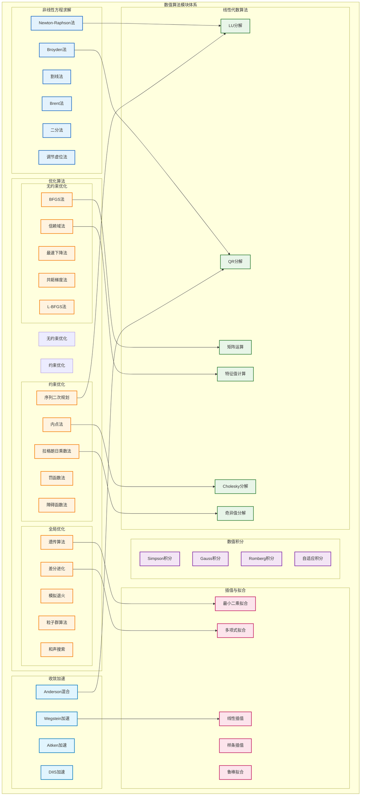
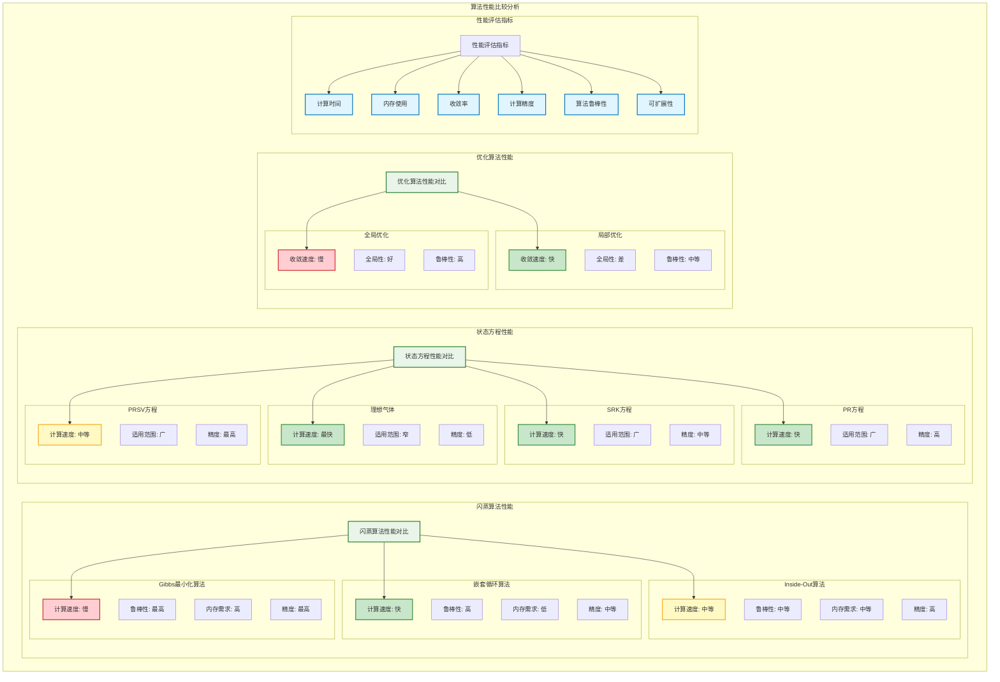

# DWSIM.Thermodynamics 算法模块详细分析图
## Detailed Algorithm Module Analysis Diagrams

**文档版本**: 1.0  
**创建日期**: 2024年12月  
**描述**: DWSIM热力学计算库算法模块详细分析和分类

---

## 1. 算法模块总体分类关系图

```mermaid
erDiagram
    DWSIM_Thermodynamics ||--o{ 状态方程算法 : contains
    DWSIM_Thermodynamics ||--o{ 活度系数算法 : contains
    DWSIM_Thermodynamics ||--o{ 闪蒸算法 : contains
    DWSIM_Thermodynamics ||--o{ 专用模型算法 : contains
    DWSIM_Thermodynamics ||--o{ 数值算法 : contains
    
    状态方程算法 ||--o{ 立方状态方程 : includes
    状态方程算法 ||--o{ 非立方状态方程 : includes
    状态方程算法 ||--o{ 理想气体 : includes
    
    立方状态方程 ||--|| Soave_Redlich_Kwong : implements
    立方状态方程 ||--|| Peng_Robinson : implements
    立方状态方程 ||--|| Peng_Robinson_Stryjek_Vera : implements
    立方状态方程 ||--|| Lee_Kesler_Plocker : implements
    
    Soave_Redlich_Kwong ||--o{ SRK基础算法 : uses
    Soave_Redlich_Kwong ||--o{ SRK混合规则 : uses
    Soave_Redlich_Kwong ||--o{ SRK逸度系数 : calculates
    Soave_Redlich_Kwong ||--o{ SRK焓熵计算 : calculates
    
    Peng_Robinson ||--o{ PR基础算法 : uses
    Peng_Robinson ||--o{ PR混合规则 : uses
    Peng_Robinson ||--o{ PR逸度系数 : calculates
    Peng_Robinson ||--o{ PR焓熵计算 : calculates
    
    Peng_Robinson_Stryjek_Vera ||--o{ PRSV基础算法 : uses
    Peng_Robinson_Stryjek_Vera ||--o{ PRSV温度函数 : uses
    Peng_Robinson_Stryjek_Vera ||--o{ PRSV体积修正 : applies
    
    Lee_Kesler_Plocker ||--o{ LKP基础算法 : uses
    Lee_Kesler_Plocker ||--o{ LKP体积平移 : applies
    Lee_Kesler_Plocker ||--o{ LKP偏心因子修正 : applies
    
    非立方状态方程 ||--|| Benedict_Webb_Rubin : implements
    非立方状态方程 ||--|| Virial方程 : implements
    非立方状态方程 ||--|| Martin_Hou方程 : implements
    
    理想气体 ||--|| 理想气体状态方程 : implements
    理想气体 ||--o{ 理想气体热容 : calculates
    理想气体 ||--o{ 理想气体焓熵 : calculates
    
    活度系数算法 ||--o{ 局部组成模型 : includes
    活度系数算法 ||--o{ 基团贡献法 : includes
    活度系数算法 ||--o{ 经验关联式 : includes
    
    局部组成模型 ||--|| NRTL : implements
    局部组成模型 ||--|| UNIQUAC : implements
    局部组成模型 ||--|| Extended_UNIQUAC : implements
    
    NRTL ||--o{ NRTL基础算法 : uses
    NRTL ||--o{ NRTL参数估算 : performs
    NRTL ||--o{ NRTL温度依赖性 : handles
    
    UNIQUAC ||--o{ UNIQUAC基础算法 : uses
    UNIQUAC ||--o{ UNIQUAC组合项 : calculates
    UNIQUAC ||--o{ UNIQUAC剩余项 : calculates
    
    Extended_UNIQUAC ||--o{ 扩展UNIQUAC算法 : uses
    Extended_UNIQUAC ||--o{ 温度依赖参数 : handles
    Extended_UNIQUAC ||--o{ 多元系统处理 : performs
    
    基团贡献法 ||--|| UNIFAC : implements
    基团贡献法 ||--|| UNIFAC_LL : implements
    基团贡献法 ||--|| MODFAC : implements
    基团贡献法 ||--|| NIST_MFAC : implements
    
    UNIFAC ||--o{ UNIFAC基础算法 : uses
    UNIFAC ||--o{ 基团识别 : performs
    UNIFAC ||--o{ 基团交互参数 : uses
    UNIFAC ||--o{ 基团活度系数 : calculates
    
    UNIFAC_LL ||--o{ 液液平衡UNIFAC : uses
    UNIFAC_LL ||--o{ LL参数集 : uses
    
    经验关联式 ||--|| Wilson方程 : implements
    经验关联式 ||--|| Margules方程 : implements
    经验关联式 ||--|| Van_Laar方程 : implements
    经验关联式 ||--|| Redlich_Kister方程 : implements
    
    闪蒸算法 ||--o{ 两相闪蒸 : includes
    闪蒸算法 ||--o{ 三相闪蒸 : includes
    闪蒸算法 ||--o{ 特殊闪蒸 : includes
    
    两相闪蒸 ||--|| 嵌套循环法 : implements
    两相闪蒸 ||--|| Inside_Out法 : implements
    两相闪蒸 ||--|| Boston_Fournier法 : implements
    
    嵌套循环法 ||--o{ 外循环算法 : uses
    嵌套循环法 ||--o{ 内循环算法 : uses
    嵌套循环法 ||--o{ K值更新 : performs
    嵌套循环法 ||--o{ 收敛加速 : applies
    
    Inside_Out法 ||--o{ 内层循环 : uses
    Inside_Out法 ||--o{ 外层循环 : uses
    Inside_Out法 ||--o{ Wegstein加速 : applies
    Inside_Out法 ||--o{ Boston_Britt算法 : uses
    
    Boston_Fournier法 ||--o{ 改进Inside_Out : uses
    Boston_Fournier法 ||--o{ 三对角矩阵求解 : performs
    Boston_Fournier法 ||--o{ Newton_Raphson : uses
    
    三相闪蒸 ||--|| 三相嵌套循环 : implements
    三相闪蒸 ||--|| Gibbs最小化 : implements
    三相闪蒸 ||--|| Boston_Fournier_3P : implements
    
    三相嵌套循环 ||--o{ VLL平衡 : calculates
    三相嵌套循环 ||--o{ 分配系数计算 : performs
    三相嵌套循环 ||--o{ 相稳定性分析 : performs
    
    Gibbs最小化 ||--o{ 目标函数构建 : performs
    Gibbs最小化 ||--o{ 约束条件处理 : handles
    Gibbs最小化 ||--o{ 优化算法选择 : performs
    Gibbs最小化 ||--o{ 全局优化 : applies
    
    Boston_Fournier_3P ||--o{ 三相Inside_Out : uses
    Boston_Fournier_3P ||--o{ 相分离检测 : performs
    Boston_Fournier_3P ||--o{ 初值估算 : performs
    
    特殊闪蒸 ||--|| 固液平衡SLE : implements
    特殊闪蒸 ||--|| 液液平衡LLE : implements
    特殊闪蒸 ||--|| 电解质SVLE : implements
    
    固液平衡SLE ||--o{ 溶解度计算 : performs
    固液平衡SLE ||--o{ 固相活度 : calculates
    固液平衡SLE ||--o{ 共晶点计算 : performs
    
    液液平衡LLE ||--o{ 分配系数 : calculates
    液液平衡LLE ||--o{ 溶解度参数 : uses
    液液平衡LLE ||--o{ 临界溶解温度 : calculates
    
    电解质SVLE ||--o{ 离子强度 : calculates
    电解质SVLE ||--o{ 活度系数 : calculates
    电解质SVLE ||--o{ 渗透系数 : calculates
    
    专用模型算法 ||--o{ 水和蒸汽 : includes
    专用模型算法 ||--o{ 制冷剂 : includes
    专用模型算法 ||--o{ 电解质 : includes
    专用模型算法 ||--o{ 石油工业 : includes
    
    水和蒸汽 ||--|| IAPWS_IF97 : implements
    水和蒸汽 ||--|| Steam_Tables : implements
    
    IAPWS_IF97 ||--o{ 区域1算法 : uses
    IAPWS_IF97 ||--o{ 区域2算法 : uses
    IAPWS_IF97 ||--o{ 区域3算法 : uses
    IAPWS_IF97 ||--o{ 区域4算法 : uses
    IAPWS_IF97 ||--o{ 区域5算法 : uses
    
    Steam_Tables ||--o{ 饱和性质 : calculates
    Steam_Tables ||--o{ 过热蒸汽 : handles
    Steam_Tables ||--o{ 压缩液体 : handles
    
    制冷剂 ||--|| CoolProp接口 : implements
    制冷剂 ||--|| 不可压缩流体 : implements
    
    CoolProp接口 ||--o{ HEOS后端 : uses
    CoolProp接口 ||--o{ REFPROP接口 : uses
    CoolProp接口 ||--o{ 多相平衡 : calculates
    
    不可压缩流体 ||--o{ 密度关联 : uses
    不可压缩流体 ||--o{ 粘度关联 : uses
    不可压缩流体 ||--o{ 热导率关联 : uses
    
    电解质 ||--|| 电解质NRTL : implements
    电解质 ||--|| Pitzer模型 : implements
    
    电解质NRTL ||--o{ 离子_分子交互 : handles
    电解质NRTL ||--o{ 离子_离子交互 : handles
    电解质NRTL ||--o{ 长程静电作用 : calculates
    
    Pitzer模型 ||--o{ Virial系数 : calculates
    Pitzer模型 ||--o{ 离子交互参数 : uses
    Pitzer模型 ||--o{ 渗透系数 : calculates
    
    石油工业 ||--|| 黑油模型 : implements
    石油工业 ||--|| 酸性水模型 : implements
    石油工业 ||--|| 海水模型 : implements
    
    黑油模型 ||--o{ PVT关联 : uses
    黑油模型 ||--o{ 气油比计算 : performs
    黑油模型 ||--o{ 体积系数 : calculates
    
    酸性水模型 ||--o{ H2S溶解度 : calculates
    酸性水模型 ||--o{ CO2溶解度 : calculates
    酸性水模型 ||--o{ NH3溶解度 : calculates
    
    海水模型 ||--o{ 盐度效应 : handles
    海水模型 ||--o{ 密度计算 : performs
    海水模型 ||--o{ 沸点升高 : calculates
    
    数值算法 ||--o{ 方程求解 : includes
    数值算法 ||--o{ 优化算法 : includes
    数值算法 ||--o{ 稳定性分析 : includes
    
    方程求解 ||--|| Newton_Raphson : implements
    方程求解 ||--|| Brent方法 : implements
    方程求解 ||--|| Secant方法 : implements
    方程求解 ||--|| Regula_Falsi : implements
    
    Newton_Raphson ||--o{ 雅可比矩阵 : uses
    Newton_Raphson ||--o{ 线性化处理 : performs
    Newton_Raphson ||--o{ 收敛判据 : applies
    
    Brent方法 ||--o{ 区间搜索 : performs
    Brent方法 ||--o{ 二次插值 : uses
    Brent方法 ||--o{ 黄金分割 : applies
    
    Secant方法 ||--o{ 割线法 : uses
    Secant方法 ||--o{ 收敛加速 : applies
    
    Regula_Falsi ||--o{ 调节虚位法 : uses
    Regula_Falsi ||--o{ 改进算法 : implements
    
    优化算法 ||--|| BFGS : implements
    优化算法 ||--|| Levenberg_Marquardt : implements
    优化算法 ||--|| 遗传算法 : implements
    优化算法 ||--|| 差分进化 : implements
    
    BFGS ||--o{ 拟牛顿法 : uses
    BFGS ||--o{ Hessian近似 : performs
    BFGS ||--o{ 线搜索 : applies
    
    Levenberg_Marquardt ||--o{ 阻尼最小二乘 : uses
    Levenberg_Marquardt ||--o{ 信赖域方法 : applies
    Levenberg_Marquardt ||--o{ 参数估计 : performs
    
    遗传算法 ||--o{ 种群初始化 : performs
    遗传算法 ||--o{ 选择操作 : applies
    遗传算法 ||--o{ 交叉变异 : performs
    遗传算法 ||--o{ 全局搜索 : enables
    
    差分进化 ||--o{ 变异策略 : uses
    差分进化 ||--o{ 交叉概率 : controls
    差分进化 ||--o{ 选择压力 : applies
    
    稳定性分析 ||--|| Michelsen_TPD : implements
    稳定性分析 ||--|| 相分离检测 : implements
    稳定性分析 ||--|| 临界点计算 : implements
    
    Michelsen_TPD ||--o{ 切平面距离 : calculates
    Michelsen_TPD ||--o{ 稳定性判据 : applies
    Michelsen_TPD ||--o{ 试验相组成 : generates
    
    相分离检测 ||--o{ Hessian矩阵 : uses
    相分离检测 ||--o{ 特征值分析 : performs
    相分离检测 ||--o{ 分岔点检测 : performs
    
    临界点计算 ||--o{ 临界条件 : applies
    临界点计算 ||--o{ 临界轨迹 : traces
    临界点计算 ||--o{ 临界端点 : identifies
```



## 2. 状态方程算法详细流程图

```mermaid
flowchart TD
    subgraph "立方状态方程通用算法流程"
        START[开始计算]
        INPUT[输入参数<br/>T, P, 组成]
        
        subgraph "参数计算"
            PURE_PARAMS[纯组分参数<br/>Tc, Pc, ω]
            ALPHA_CALC[α函数计算<br/>温度依赖项]
            A_B_CALC[a, b参数计算]
            MIXING_RULES[混合规则<br/>van der Waals]
        end
        
        subgraph "立方方程求解"
            CUBIC_EQ[立方方程<br/>Z³ + pZ² + qZ + r = 0]
            DISCRIMINANT[判别式计算<br/>Δ = 18pqr - 4p³r + p²q² - 4q³ - 27r²]
            ROOT_ANALYSIS[根的分析]
            
            subgraph "根的选择"
                SINGLE_ROOT[单实根<br/>气相或液相]
                THREE_ROOTS[三实根<br/>两相区域]
                PHASE_SELECT[相态选择<br/>最小Gibbs能]
            end
        end
        
        subgraph "物性计算"
            FUGACITY[逸度系数<br/>ln φᵢ]
            ENTHALPY[焓偏差<br/>H - H^ig]
            ENTROPY[熵偏差<br/>S - S^ig]
            DENSITY[密度<br/>ρ = PM/ZRT]
            CP[等压热容<br/>Cp - Cp^ig]
        end
        
        OUTPUT[输出结果]
        END[结束]
    end
    
    %% 流程连接
    START --> INPUT
    INPUT --> PURE_PARAMS
    PURE_PARAMS --> ALPHA_CALC
    ALPHA_CALC --> A_B_CALC
    A_B_CALC --> MIXING_RULES
    
    MIXING_RULES --> CUBIC_EQ
    CUBIC_EQ --> DISCRIMINANT
    DISCRIMINANT --> ROOT_ANALYSIS
    
    ROOT_ANALYSIS --> SINGLE_ROOT
    ROOT_ANALYSIS --> THREE_ROOTS
    THREE_ROOTS --> PHASE_SELECT
    
    SINGLE_ROOT --> FUGACITY
    PHASE_SELECT --> FUGACITY
    FUGACITY --> ENTHALPY
    ENTHALPY --> ENTROPY
    ENTROPY --> DENSITY
    DENSITY --> CP
    
    CP --> OUTPUT
    OUTPUT --> END
    
    classDef startEnd fill:#e8f5e8,stroke:#2e7d32,stroke-width:2px
    classDef process fill:#e3f2fd,stroke:#1565c0,stroke-width:2px
    classDef calculation fill:#fff3e0,stroke:#f57c00,stroke-width:2px
    classDef decision fill:#f3e5f5,stroke:#7b1fa2,stroke-width:2px
    
    class START,END startEnd
    class INPUT,OUTPUT process
    class PURE_PARAMS,ALPHA_CALC,A_B_CALC,MIXING_RULES,FUGACITY,ENTHALPY,ENTROPY,DENSITY,CP calculation
    class CUBIC_EQ,DISCRIMINANT,ROOT_ANALYSIS,SINGLE_ROOT,THREE_ROOTS,PHASE_SELECT decision
```



## 3. 闪蒸算法详细流程图

```mermaid
flowchart TD
    subgraph "嵌套循环闪蒸算法"
        FLASH_START[闪蒸开始]
        FLASH_INPUT[输入条件<br/>T, P, z]
        
        subgraph "初始化"
            K_INIT[K值初始化<br/>Wilson方程]
            VF_INIT[汽相分率初始化<br/>Rachford-Rice]
            COMP_INIT[相组成初始化<br/>x, y计算]
        end
        
        subgraph "外循环 (Outer Loop)"
            OUTER_START[外循环开始]
            OUTER_ITER[外循环迭代计数]
            
            subgraph "内循环 (Inner Loop)"
                INNER_START[内循环开始]
                INNER_ITER[内循环迭代计数]
                
                FUGACITY_L[液相逸度系数<br/>φᵢᴸ(T,P,x)]
                FUGACITY_V[汽相逸度系数<br/>φᵢⱽ(T,P,y)]
                
                K_UPDATE[K值更新<br/>Kᵢ = φᵢᴸ/φᵢⱽ]
                INNER_CONV[内循环收敛检查<br/>|Kᵢⁿ⁺¹ - Kᵢⁿ| < εᵢₙₙₑᵣ]
            end
            
            VF_SOLVE[汽相分率求解<br/>Rachford-Rice方程]
            COMP_UPDATE[相组成更新<br/>xᵢ, yᵢ计算]
            
            OUTER_CONV[外循环收敛检查<br/>|Vⁿ⁺¹ - Vⁿ| < εₒᵤₜₑᵣ]
            
            subgraph "加速收敛"
                WEGSTEIN[Wegstein加速]
                AITKEN[Aitken加速]
                ANDERSON[Anderson混合]
            end
        end
        
        subgraph "稳定性检查"
            STABILITY[相稳定性测试<br/>TPD分析]
            PHASE_SPLIT[相分离检测]
            TRIVIAL_CHECK[平凡解检查]
        end
        
        subgraph "结果输出"
            PHASE_PROPS[相性质计算]
            MATERIAL_BALANCE[物料平衡检查]
            FLASH_RESULT[闪蒸结果输出]
        end
        
        FLASH_END[闪蒸结束]
    end
    
    %% 流程连接
    FLASH_START --> FLASH_INPUT
    FLASH_INPUT --> K_INIT
    K_INIT --> VF_INIT
    VF_INIT --> COMP_INIT
    
    COMP_INIT --> OUTER_START
    OUTER_START --> OUTER_ITER
    OUTER_ITER --> INNER_START
    
    INNER_START --> INNER_ITER
    INNER_ITER --> FUGACITY_L
    FUGACITY_L --> FUGACITY_V
    FUGACITY_V --> K_UPDATE
    K_UPDATE --> INNER_CONV
    
    INNER_CONV -->|未收敛| INNER_ITER
    INNER_CONV -->|收敛| VF_SOLVE
    
    VF_SOLVE --> COMP_UPDATE
    COMP_UPDATE --> OUTER_CONV
    
    OUTER_CONV -->|未收敛| WEGSTEIN
    WEGSTEIN --> OUTER_ITER
    OUTER_CONV -->|收敛| STABILITY
    
    STABILITY --> PHASE_SPLIT
    PHASE_SPLIT --> TRIVIAL_CHECK
    TRIVIAL_CHECK --> PHASE_PROPS
    
    PHASE_PROPS --> MATERIAL_BALANCE
    MATERIAL_BALANCE --> FLASH_RESULT
    FLASH_RESULT --> FLASH_END
    
    classDef startEnd fill:#e8f5e8,stroke:#2e7d32,stroke-width:2px
    classDef process fill:#e3f2fd,stroke:#1565c0,stroke-width:2px
    classDef calculation fill:#fff3e0,stroke:#f57c00,stroke-width:2px
    classDef decision fill:#f3e5f5,stroke:#7b1fa2,stroke-width:2px
    classDef acceleration fill:#fce4ec,stroke:#c2185b,stroke-width:2px
    
    class FLASH_START,FLASH_END startEnd
    class FLASH_INPUT,FLASH_RESULT process
    class K_INIT,VF_INIT,COMP_INIT,FUGACITY_L,FUGACITY_V,K_UPDATE,VF_SOLVE,COMP_UPDATE,PHASE_PROPS calculation
    class INNER_CONV,OUTER_CONV,STABILITY,PHASE_SPLIT,TRIVIAL_CHECK decision
    class WEGSTEIN,AITKEN,ANDERSON acceleration
```

## 4. Gibbs最小化算法流程图

```mermaid
flowchart TD
    subgraph "Gibbs最小化三相闪蒸算法"
        GIBBS_START[Gibbs最小化开始]
        GIBBS_INPUT[输入条件<br/>T, P, z, 初始相数]
        
        subgraph "目标函数构建"
            OBJECTIVE[目标函数<br/>G = Σnᵢμᵢ]
            CHEMICAL_POT[化学势计算<br/>μᵢ = μᵢ⁰ + RT ln(aᵢ)]
            CONSTRAINTS[约束条件<br/>Σnᵢ = n_total]
        end
        
        subgraph "优化算法选择"
            OPT_METHOD{优化方法选择}
            NEWTON_OPT[Newton法优化]
            QUASI_NEWTON[拟Newton法]
            GLOBAL_OPT[全局优化<br/>差分进化]
        end
        
        subgraph "Newton优化"
            HESSIAN[Hessian矩阵<br/>∂²G/∂nᵢ∂nⱼ]
            GRADIENT[梯度向量<br/>∂G/∂nᵢ]
            NEWTON_STEP[Newton步长<br/>Δn = -H⁻¹g]
            LINE_SEARCH[线搜索<br/>步长优化]
        end
        
        subgraph "拟Newton优化"
            BFGS_UPDATE[BFGS更新<br/>Hessian近似]
            QUASI_STEP[拟Newton步长]
            QUASI_LINE[线搜索]
        end
        
        subgraph "全局优化"
            POPULATION[种群初始化]
            MUTATION[变异操作]
            CROSSOVER[交叉操作]
            SELECTION[选择操作]
            GLOBAL_CONV[全局收敛检查]
        end
        
        subgraph "收敛检查"
            CONV_CHECK[收敛检查<br/>||∇G|| < ε]
            PHASE_CHECK[相数检查]
            STABILITY_CHECK[稳定性检查]
        end
        
        subgraph "结果处理"
            PHASE_AMOUNTS[相摩尔数<br/>nᵢʲ]
            PHASE_FRACTIONS[相分率<br/>βʲ]
            COMPOSITIONS[相组成<br/>xᵢʲ]
            GIBBS_RESULT[Gibbs结果输出]
        end
        
        GIBBS_END[Gibbs最小化结束]
    end
    
    %% 流程连接
    GIBBS_START --> GIBBS_INPUT
    GIBBS_INPUT --> OBJECTIVE
    OBJECTIVE --> CHEMICAL_POT
    CHEMICAL_POT --> CONSTRAINTS
    
    CONSTRAINTS --> OPT_METHOD
    OPT_METHOD -->|Newton法| NEWTON_OPT
    OPT_METHOD -->|拟Newton法| QUASI_NEWTON
    OPT_METHOD -->|全局优化| GLOBAL_OPT
    
    NEWTON_OPT --> HESSIAN
    HESSIAN --> GRADIENT
    GRADIENT --> NEWTON_STEP
    NEWTON_STEP --> LINE_SEARCH
    
    QUASI_NEWTON --> BFGS_UPDATE
    BFGS_UPDATE --> QUASI_STEP
    QUASI_STEP --> QUASI_LINE
    
    GLOBAL_OPT --> POPULATION
    POPULATION --> MUTATION
    MUTATION --> CROSSOVER
    CROSSOVER --> SELECTION
    SELECTION --> GLOBAL_CONV
    
    LINE_SEARCH --> CONV_CHECK
    QUASI_LINE --> CONV_CHECK
    GLOBAL_CONV --> CONV_CHECK
    
    CONV_CHECK -->|未收敛| OPT_METHOD
    CONV_CHECK -->|收敛| PHASE_CHECK
    
    PHASE_CHECK --> STABILITY_CHECK
    STABILITY_CHECK --> PHASE_AMOUNTS
    PHASE_AMOUNTS --> PHASE_FRACTIONS
    PHASE_FRACTIONS --> COMPOSITIONS
    COMPOSITIONS --> GIBBS_RESULT
    GIBBS_RESULT --> GIBBS_END
    
    classDef startEnd fill:#e8f5e8,stroke:#2e7d32,stroke-width:2px
    classDef process fill:#e3f2fd,stroke:#1565c0,stroke-width:2px
    classDef calculation fill:#fff3e0,stroke:#f57c00,stroke-width:2px
    classDef optimization fill:#f3e5f5,stroke:#7b1fa2,stroke-width:2px
    classDef decision fill:#fce4ec,stroke:#c2185b,stroke-width:2px
    
    class GIBBS_START,GIBBS_END startEnd
    class GIBBS_INPUT,GIBBS_RESULT process
    class OBJECTIVE,CHEMICAL_POT,CONSTRAINTS,HESSIAN,GRADIENT,NEWTON_STEP,PHASE_AMOUNTS,PHASE_FRACTIONS,COMPOSITIONS calculation
    class NEWTON_OPT,QUASI_NEWTON,GLOBAL_OPT,BFGS_UPDATE,POPULATION,MUTATION,CROSSOVER,SELECTION optimization
    class OPT_METHOD,CONV_CHECK,PHASE_CHECK,STABILITY_CHECK decision
```

## 5. 数值算法模块关系图



## 6. 算法性能比较图



---

## 算法模块总结

### 1. 核心算法分类
- **状态方程算法**: 15种主要算法，涵盖立方和非立方方程
- **活度系数算法**: 12种模型，包括局部组成和基团贡献法
- **闪蒸算法**: 8种主要算法，支持两相和三相计算
- **专用模型**: 6种特殊应用模型
- **数值算法**: 30+种基础数值方法

### 2. 算法性能特征
- **计算速度**: 嵌套循环 > Inside-Out > Gibbs最小化
- **计算精度**: Gibbs最小化 > Inside-Out > 嵌套循环
- **鲁棒性**: Gibbs最小化 > 嵌套循环 > Inside-Out
- **内存需求**: 嵌套循环 < Inside-Out < Gibbs最小化

### 3. 算法选择策略
- **简单系统**: 嵌套循环算法，快速收敛
- **复杂系统**: Inside-Out算法，平衡性能和精度
- **严格计算**: Gibbs最小化，最高精度和可靠性
- **实时计算**: 理想气体或简化模型

### 4. 优化和扩展方向
- **并行计算**: 支持多核和GPU加速
- **自适应算法**: 根据系统特征自动选择算法
- **机器学习**: 集成AI算法提高预测精度
- **云计算**: 支持分布式大规模计算

---

**文档状态**: ✅ 完成  
**最后更新**: 2024年12月  
**维护者**: OpenAspen项目组 