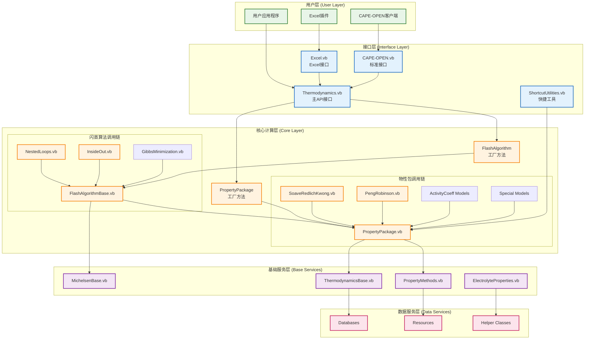
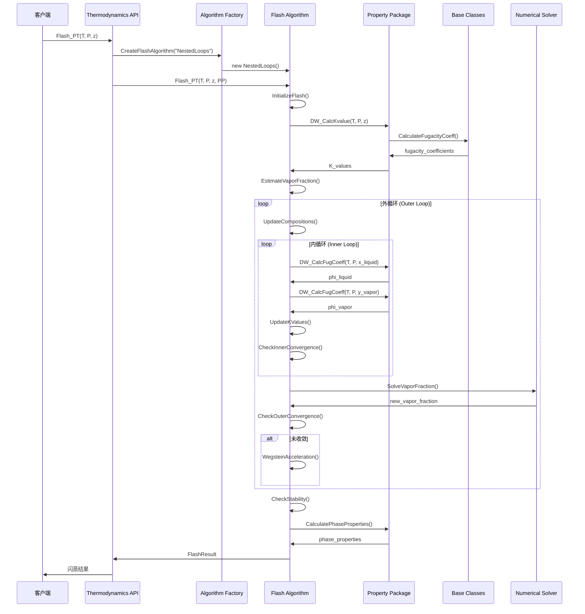
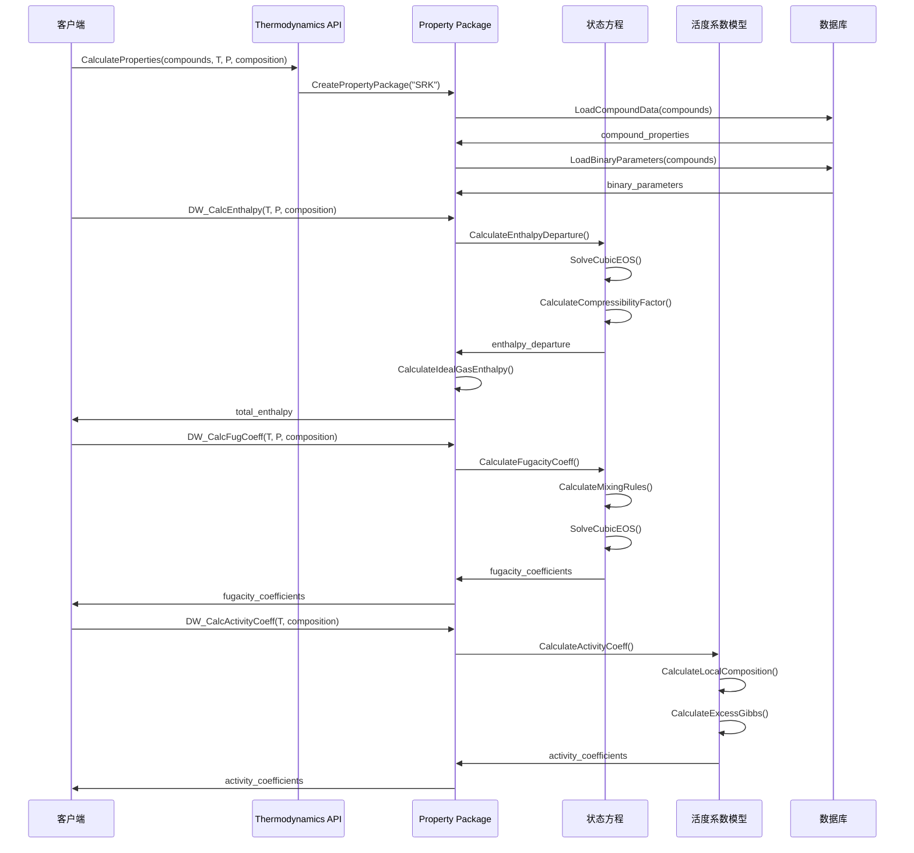
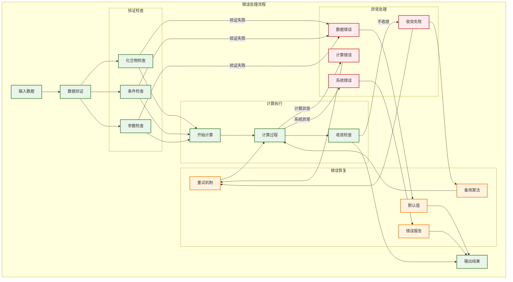
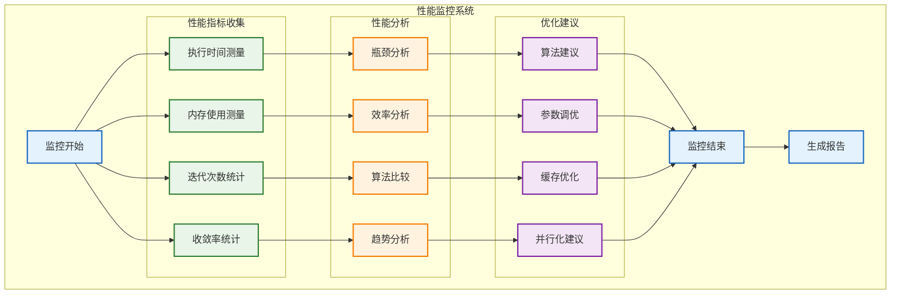

# DWSIM.Thermodynamics 调用关系图和时序图
## Call Relationship and Sequence Diagrams

**文档版本**: 1.0  
**创建日期**: 2024年12月  
**描述**: DWSIM热力学计算库详细调用关系和时序分析

---

## 1. 总体调用关系图



## 2. 物性计算调用关系图

```mermaid
graph TD
    subgraph "物性计算调用链"
        CLIENT[客户端调用]
        
        subgraph "API层"
            CALC_PROP[CalculateProperties()]
            DW_CALC[DW_Calc系列方法]
        end
        
        subgraph "物性包层"
            PP_MAIN[PropertyPackage主类]
            PP_SPECIFIC[具体物性包实现]
        end
        
        subgraph "计算方法层"
            ENTHALPY[DW_CalcEnthalpy()]
            ENTROPY[DW_CalcEntropy()]
            FUGACITY[DW_CalcFugCoeff()]
            ACTIVITY[DW_CalcActivityCoeff()]
            KVALUE[DW_CalcKvalue()]
            DENSITY[DW_CalcDensity()]
            CP[DW_CalcCp()]
        end
        
        subgraph "基础计算层"
            EOS_CALC[状态方程计算]
            ACTIVITY_CALC[活度系数计算]
            MIXING_RULES[混合规则]
            PURE_PROPS[纯组分性质]
        end
        
        subgraph "数据层"
            COMPOUND_DATA[化合物数据]
            BIP_DATA[二元交互参数]
            CORRELATION[关联式数据]
        end
    end
    
    %% 调用关系
    CLIENT --> CALC_PROP
    CALC_PROP --> DW_CALC
    DW_CALC --> PP_MAIN
    PP_MAIN --> PP_SPECIFIC
    
    PP_SPECIFIC --> ENTHALPY
    PP_SPECIFIC --> ENTROPY
    PP_SPECIFIC --> FUGACITY
    PP_SPECIFIC --> ACTIVITY
    PP_SPECIFIC --> KVALUE
    PP_SPECIFIC --> DENSITY
    PP_SPECIFIC --> CP
    
    ENTHALPY --> EOS_CALC
    ENTROPY --> EOS_CALC
    FUGACITY --> EOS_CALC
    ACTIVITY --> ACTIVITY_CALC
    KVALUE --> EOS_CALC
    KVALUE --> ACTIVITY_CALC
    DENSITY --> EOS_CALC
    CP --> EOS_CALC
    
    EOS_CALC --> MIXING_RULES
    EOS_CALC --> PURE_PROPS
    ACTIVITY_CALC --> BIP_DATA
    MIXING_RULES --> BIP_DATA
    PURE_PROPS --> COMPOUND_DATA
    PURE_PROPS --> CORRELATION
    
    classDef apiLayer fill:#e8f5e8,stroke:#2e7d32,stroke-width:2px
    classDef ppLayer fill:#e3f2fd,stroke:#1565c0,stroke-width:2px
    classDef methodLayer fill:#fff3e0,stroke:#f57c00,stroke-width:2px
    classDef calcLayer fill:#f3e5f5,stroke:#7b1fa2,stroke-width:2px
    classDef dataLayer fill:#fce4ec,stroke:#c2185b,stroke-width:2px
    
    class CLIENT,CALC_PROP,DW_CALC apiLayer
    class PP_MAIN,PP_SPECIFIC ppLayer
    class ENTHALPY,ENTROPY,FUGACITY,ACTIVITY,KVALUE,DENSITY,CP methodLayer
    class EOS_CALC,ACTIVITY_CALC,MIXING_RULES,PURE_PROPS calcLayer
    class COMPOUND_DATA,BIP_DATA,CORRELATION dataLayer
```

## 3. 闪蒸计算调用关系图

```mermaid
graph TD
    subgraph "闪蒸计算调用链"
        FLASH_CLIENT[闪蒸计算请求]
        
        subgraph "闪蒸API层"
            FLASH_PT[Flash_PT()]
            FLASH_PH[Flash_PH()]
            FLASH_PS[Flash_PS()]
            FLASH_TV[Flash_TV()]
        end
        
        subgraph "算法选择层"
            ALGORITHM_FACTORY[算法工厂]
            NESTED_LOOPS[嵌套循环算法]
            INSIDE_OUT[Inside-Out算法]
            GIBBS_MIN[Gibbs最小化算法]
        end
        
        subgraph "算法执行层"
            INIT_FLASH[初始化闪蒸]
            OUTER_LOOP[外循环]
            INNER_LOOP[内循环]
            CONVERGENCE_CHECK[收敛检查]
            STABILITY_TEST[稳定性测试]
        end
        
        subgraph "物性调用层"
            K_VALUE_CALC[K值计算]
            FUGACITY_CALC[逸度系数计算]
            ACTIVITY_CALC[活度系数计算]
            PHASE_PROPS[相性质计算]
        end
        
        subgraph "数值求解层"
            NEWTON_RAPHSON[Newton-Raphson求解]
            BRENT_METHOD[Brent方法]
            WEGSTEIN_ACCEL[Wegstein加速]
            LINE_SEARCH[线搜索]
        end
    end
    
    %% 调用关系
    FLASH_CLIENT --> FLASH_PT
    FLASH_CLIENT --> FLASH_PH
    FLASH_CLIENT --> FLASH_PS
    FLASH_CLIENT --> FLASH_TV
    
    FLASH_PT --> ALGORITHM_FACTORY
    FLASH_PH --> ALGORITHM_FACTORY
    FLASH_PS --> ALGORITHM_FACTORY
    FLASH_TV --> ALGORITHM_FACTORY
    
    ALGORITHM_FACTORY --> NESTED_LOOPS
    ALGORITHM_FACTORY --> INSIDE_OUT
    ALGORITHM_FACTORY --> GIBBS_MIN
    
    NESTED_LOOPS --> INIT_FLASH
    INSIDE_OUT --> INIT_FLASH
    GIBBS_MIN --> INIT_FLASH
    
    INIT_FLASH --> OUTER_LOOP
    OUTER_LOOP --> INNER_LOOP
    INNER_LOOP --> CONVERGENCE_CHECK
    CONVERGENCE_CHECK --> STABILITY_TEST
    
    OUTER_LOOP --> K_VALUE_CALC
    INNER_LOOP --> FUGACITY_CALC
    INNER_LOOP --> ACTIVITY_CALC
    CONVERGENCE_CHECK --> PHASE_PROPS
    
    K_VALUE_CALC --> NEWTON_RAPHSON
    FUGACITY_CALC --> BRENT_METHOD
    OUTER_LOOP --> WEGSTEIN_ACCEL
    STABILITY_TEST --> LINE_SEARCH
    
    classDef clientLayer fill:#e8f5e8,stroke:#2e7d32,stroke-width:2px
    classDef apiLayer fill:#e3f2fd,stroke:#1565c0,stroke-width:2px
    classDef algorithmLayer fill:#fff3e0,stroke:#f57c00,stroke-width:2px
    classDef executionLayer fill:#f3e5f5,stroke:#7b1fa2,stroke-width:2px
    classDef propertyLayer fill:#fce4ec,stroke:#c2185b,stroke-width:2px
    classDef numericalLayer fill:#e1f5fe,stroke:#0277bd,stroke-width:2px
    
    class FLASH_CLIENT clientLayer
    class FLASH_PT,FLASH_PH,FLASH_PS,FLASH_TV apiLayer
    class ALGORITHM_FACTORY,NESTED_LOOPS,INSIDE_OUT,GIBBS_MIN algorithmLayer
    class INIT_FLASH,OUTER_LOOP,INNER_LOOP,CONVERGENCE_CHECK,STABILITY_TEST executionLayer
    class K_VALUE_CALC,FUGACITY_CALC,ACTIVITY_CALC,PHASE_PROPS propertyLayer
    class NEWTON_RAPHSON,BRENT_METHOD,WEGSTEIN_ACCEL,LINE_SEARCH numericalLayer
```

## 4. PT闪蒸计算时序图



## 5. 物性计算时序图



## 6. 错误处理和异常流程图



## 7. 性能监控调用图



---

## 调用关系总结

### 1. 分层调用架构
- **用户层**: 提供多种接口入口
- **API层**: 统一的接口抽象
- **核心层**: 具体算法实现
- **基础层**: 通用服务和工具
- **数据层**: 数据存储和管理

### 2. 关键调用路径
- **物性计算路径**: Client → API → PropertyPackage → EOS/Activity → Base → Data
- **闪蒸计算路径**: Client → API → FlashAlgorithm → PropertyPackage → Solver
- **错误处理路径**: Exception → Handler → Recovery → Report

### 3. 性能优化点
- **缓存机制**: 避免重复计算
- **算法选择**: 根据问题特征选择最优算法
- **并行计算**: 支持多线程计算
- **内存管理**: 高效的内存使用

### 4. 扩展性设计
- **工厂模式**: 支持新算法和模型的添加
- **策略模式**: 支持算法的动态切换
- **观察者模式**: 支持计算过程的监控
- **适配器模式**: 支持外部库的集成

---

**文档状态**: ✅ 完成  
**最后更新**: 2024年12月  
**维护者**: OpenAspen项目组 