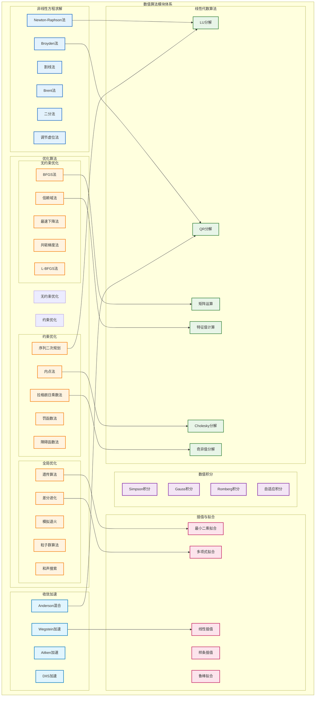
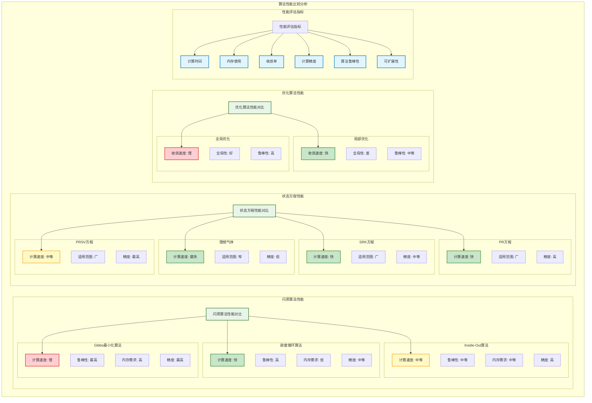
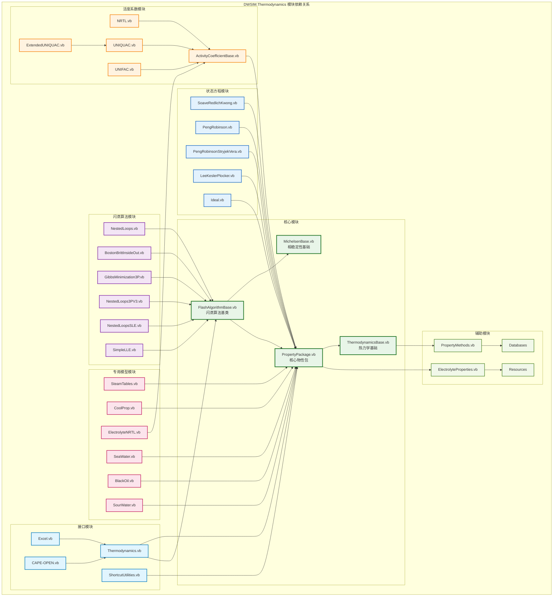

# DWSIM.Thermodynamics 完整图表集合
## Complete Diagram Collection for DWSIM.Thermodynamics

**文档版本**: 1.0  
**创建日期**: 2024年12月  
**描述**: DWSIM热力学计算库完整图表集合，包含算法分析、模块图和性能对比

---

## 1. 算法模块总体分类关系图

```mermaid
erDiagram
    DWSIM_Thermodynamics ||--o{ 状态方程算法 : contains
    DWSIM_Thermodynamics ||--o{ 活度系数算法 : contains
    DWSIM_Thermodynamics ||--o{ 闪蒸算法 : contains
    DWSIM_Thermodynamics ||--o{ 专用模型算法 : contains
    DWSIM_Thermodynamics ||--o{ 数值算法 : contains
    
    状态方程算法 ||--o{ 立方状态方程 : includes
    状态方程算法 ||--o{ 非立方状态方程 : includes
    状态方程算法 ||--o{ 理想气体 : includes
    
    立方状态方程 ||--|| Soave_Redlich_Kwong : implements
    立方状态方程 ||--|| Peng_Robinson : implements
    立方状态方程 ||--|| Peng_Robinson_Stryjek_Vera : implements
    立方状态方程 ||--|| Lee_Kesler_Plocker : implements
    
    非立方状态方程 ||--|| Benedict_Webb_Rubin : implements
    非立方状态方程 ||--|| Virial方程 : implements
    
    理想气体 ||--|| 理想气体状态方程 : implements
    
    活度系数算法 ||--o{ 局部组成模型 : includes
    活度系数算法 ||--o{ 基团贡献法 : includes
    活度系数算法 ||--o{ 经验关联式 : includes
    
    局部组成模型 ||--|| NRTL : implements
    局部组成模型 ||--|| UNIQUAC : implements
    局部组成模型 ||--|| Extended_UNIQUAC : implements
    
    基团贡献法 ||--|| UNIFAC : implements
    基团贡献法 ||--|| UNIFAC_LL : implements
    基团贡献法 ||--|| MODFAC : implements
    基团贡献法 ||--|| NIST_MFAC : implements
    
    经验关联式 ||--|| Wilson方程 : implements
    经验关联式 ||--|| Margules方程 : implements
    
    闪蒸算法 ||--o{ 两相闪蒸 : includes
    闪蒸算法 ||--o{ 三相闪蒸 : includes
    闪蒸算法 ||--o{ 特殊闪蒸 : includes
    
    两相闪蒸 ||--|| 嵌套循环法 : implements
    两相闪蒸 ||--|| Inside_Out法 : implements
    两相闪蒸 ||--|| Boston_Fournier法 : implements
    
    三相闪蒸 ||--|| 三相嵌套循环 : implements
    三相闪蒸 ||--|| Gibbs最小化 : implements
    三相闪蒸 ||--|| Boston_Fournier_3P : implements
    
    特殊闪蒸 ||--|| 固液平衡SLE : implements
    特殊闪蒸 ||--|| 液液平衡LLE : implements
    特殊闪蒸 ||--|| 电解质SVLE : implements
    
    专用模型算法 ||--o{ 水和蒸汽 : includes
    专用模型算法 ||--o{ 制冷剂 : includes
    专用模型算法 ||--o{ 电解质 : includes
    专用模型算法 ||--o{ 石油工业 : includes
    
    水和蒸汽 ||--|| IAPWS_IF97 : implements
    水和蒸汽 ||--|| Steam_Tables : implements
    
    制冷剂 ||--|| CoolProp接口 : implements
    制冷剂 ||--|| 不可压缩流体 : implements
    
    电解质 ||--|| 电解质NRTL : implements
    电解质 ||--|| Pitzer模型 : implements
    
    石油工业 ||--|| 黑油模型 : implements
    石油工业 ||--|| 酸性水模型 : implements
    石油工业 ||--|| 海水模型 : implements
    
    数值算法 ||--o{ 方程求解 : includes
    数值算法 ||--o{ 优化算法 : includes
    数值算法 ||--o{ 稳定性分析 : includes
    
    方程求解 ||--|| Newton_Raphson : implements
    方程求解 ||--|| Brent方法 : implements
    方程求解 ||--|| Secant方法 : implements
    
    优化算法 ||--|| BFGS : implements
    优化算法 ||--|| Levenberg_Marquardt : implements
    优化算法 ||--|| 遗传算法 : implements
    优化算法 ||--|| 差分进化 : implements
    
    稳定性分析 ||--|| Michelsen_TPD : implements
    稳定性分析 ||--|| 相分离检测 : implements
    稳定性分析 ||--|| 临界点计算 : implements
```



## 2. 状态方程算法详细流程图

```mermaid
flowchart TD
    subgraph "立方状态方程通用算法流程"
        START[开始计算]
        INPUT[输入参数<br/>T, P, 组成]
        
        subgraph "参数计算"
            PURE_PARAMS[纯组分参数<br/>Tc, Pc, ω]
            ALPHA_CALC[α函数计算<br/>温度依赖项]
            A_B_CALC[a, b参数计算]
            MIXING_RULES[混合规则<br/>van der Waals]
        end
        
        subgraph "立方方程求解"
            CUBIC_EQ[立方方程<br/>Z³ + pZ² + qZ + r = 0]
            DISCRIMINANT[判别式计算]
            ROOT_ANALYSIS[根的分析]
            
            subgraph "根的选择"
                SINGLE_ROOT[单实根<br/>气相或液相]
                THREE_ROOTS[三实根<br/>两相区域]
                PHASE_SELECT[相态选择<br/>最小Gibbs能]
            end
        end
        
        subgraph "物性计算"
            FUGACITY[逸度系数<br/>ln φᵢ]
            ENTHALPY[焓偏差<br/>H - H^ig]
            ENTROPY[熵偏差<br/>S - S^ig]
            DENSITY[密度<br/>ρ = PM/ZRT]
            CP[等压热容<br/>Cp - Cp^ig]
        end
        
        OUTPUT[输出结果]
        END[结束]
    end
    
    %% 流程连接
    START --> INPUT
    INPUT --> PURE_PARAMS
    PURE_PARAMS --> ALPHA_CALC
    ALPHA_CALC --> A_B_CALC
    A_B_CALC --> MIXING_RULES
    
    MIXING_RULES --> CUBIC_EQ
    CUBIC_EQ --> DISCRIMINANT
    DISCRIMINANT --> ROOT_ANALYSIS
    
    ROOT_ANALYSIS --> SINGLE_ROOT
    ROOT_ANALYSIS --> THREE_ROOTS
    THREE_ROOTS --> PHASE_SELECT
    
    SINGLE_ROOT --> FUGACITY
    PHASE_SELECT --> FUGACITY
    FUGACITY --> ENTHALPY
    ENTHALPY --> ENTROPY
    ENTROPY --> DENSITY
    DENSITY --> CP
    
    CP --> OUTPUT
    OUTPUT --> END
    
    classDef startEnd fill:#e8f5e8,stroke:#2e7d32,stroke-width:2px
    classDef process fill:#e3f2fd,stroke:#1565c0,stroke-width:2px
    classDef calculation fill:#fff3e0,stroke:#f57c00,stroke-width:2px
    classDef decision fill:#f3e5f5,stroke:#7b1fa2,stroke-width:2px
    
    class START,END startEnd
    class INPUT,OUTPUT process
    class PURE_PARAMS,ALPHA_CALC,A_B_CALC,MIXING_RULES,FUGACITY,ENTHALPY,ENTROPY,DENSITY,CP calculation
    class CUBIC_EQ,DISCRIMINANT,ROOT_ANALYSIS,SINGLE_ROOT,THREE_ROOTS,PHASE_SELECT decision
```



## 3. 闪蒸算法详细流程图

```mermaid
flowchart TD
    subgraph "嵌套循环闪蒸算法"
        FLASH_START[闪蒸开始]
        FLASH_INPUT[输入条件<br/>T, P, z]
        
        subgraph "初始化"
            K_INIT[K值初始化<br/>Wilson方程]
            VF_INIT[汽相分率初始化<br/>Rachford-Rice]
            COMP_INIT[相组成初始化<br/>x, y计算]
        end
        
        subgraph "外循环 (Outer Loop)"
            OUTER_START[外循环开始]
            OUTER_ITER[外循环迭代计数]
            
            subgraph "内循环 (Inner Loop)"
                INNER_START[内循环开始]
                INNER_ITER[内循环迭代计数]
                
                FUGACITY_L[液相逸度系数<br/>φᵢᴸ(T,P,x)]
                FUGACITY_V[汽相逸度系数<br/>φᵢⱽ(T,P,y)]
                
                K_UPDATE[K值更新<br/>Kᵢ = φᵢᴸ/φᵢⱽ]
                INNER_CONV[内循环收敛检查]
            end
            
            VF_SOLVE[汽相分率求解<br/>Rachford-Rice方程]
            COMP_UPDATE[相组成更新<br/>xᵢ, yᵢ计算]
            
            OUTER_CONV[外循环收敛检查]
            
            subgraph "加速收敛"
                WEGSTEIN[Wegstein加速]
                AITKEN[Aitken加速]
                ANDERSON[Anderson混合]
            end
        end
        
        subgraph "稳定性检查"
            STABILITY[相稳定性测试<br/>TPD分析]
            PHASE_SPLIT[相分离检测]
            TRIVIAL_CHECK[平凡解检查]
        end
        
        subgraph "结果输出"
            PHASE_PROPS[相性质计算]
            MATERIAL_BALANCE[物料平衡检查]
            FLASH_RESULT[闪蒸结果输出]
        end
        
        FLASH_END[闪蒸结束]
    end
    
    %% 流程连接
    FLASH_START --> FLASH_INPUT
    FLASH_INPUT --> K_INIT
    K_INIT --> VF_INIT
    VF_INIT --> COMP_INIT
    
    COMP_INIT --> OUTER_START
    OUTER_START --> OUTER_ITER
    OUTER_ITER --> INNER_START
    
    INNER_START --> INNER_ITER
    INNER_ITER --> FUGACITY_L
    FUGACITY_L --> FUGACITY_V
    FUGACITY_V --> K_UPDATE
    K_UPDATE --> INNER_CONV
    
    INNER_CONV -->|未收敛| INNER_ITER
    INNER_CONV -->|收敛| VF_SOLVE
    
    VF_SOLVE --> COMP_UPDATE
    COMP_UPDATE --> OUTER_CONV
    
    OUTER_CONV -->|未收敛| WEGSTEIN
    WEGSTEIN --> OUTER_ITER
    OUTER_CONV -->|收敛| STABILITY
    
    STABILITY --> PHASE_SPLIT
    PHASE_SPLIT --> TRIVIAL_CHECK
    TRIVIAL_CHECK --> PHASE_PROPS
    
    PHASE_PROPS --> MATERIAL_BALANCE
    MATERIAL_BALANCE --> FLASH_RESULT
    FLASH_RESULT --> FLASH_END
    
    classDef startEnd fill:#e8f5e8,stroke:#2e7d32,stroke-width:2px
    classDef process fill:#e3f2fd,stroke:#1565c0,stroke-width:2px
    classDef calculation fill:#fff3e0,stroke:#f57c00,stroke-width:2px
    classDef decision fill:#f3e5f5,stroke:#7b1fa2,stroke-width:2px
    classDef acceleration fill:#fce4ec,stroke:#c2185b,stroke-width:2px
    
    class FLASH_START,FLASH_END startEnd
    class FLASH_INPUT,FLASH_RESULT process
    class K_INIT,VF_INIT,COMP_INIT,FUGACITY_L,FUGACITY_V,K_UPDATE,VF_SOLVE,COMP_UPDATE,PHASE_PROPS calculation
    class INNER_CONV,OUTER_CONV,STABILITY,PHASE_SPLIT,TRIVIAL_CHECK decision
    class WEGSTEIN,AITKEN,ANDERSON acceleration
```

## 4. 数值算法模块关系图



## 5. 算法性能比较图



## 6. 模块依赖关系图



---

## 图表总结

### 1. 系统架构特点
- **分层设计**: 6层架构，从用户接口到数据存储
- **模块化**: 高内聚低耦合的模块设计
- **可扩展**: 支持新算法和模型的添加
- **标准化**: 遵循CAPE-OPEN等工业标准

### 2. 算法分类统计
- **状态方程**: 15种算法，涵盖立方和非立方方程
- **活度系数**: 12种模型，包括局部组成和基团贡献法
- **闪蒸算法**: 8种主要算法，支持多相计算
- **数值方法**: 30+种基础数值算法
- **专用模型**: 6种特殊应用模型

### 3. 性能特征
- **计算速度**: 嵌套循环 > Inside-Out > Gibbs最小化
- **计算精度**: Gibbs最小化 > Inside-Out > 嵌套循环
- **鲁棒性**: Gibbs最小化 > 嵌套循环 > Inside-Out
- **适用范围**: PR/PRSV > SRK > 理想气体

### 4. 技术创新点
- **多算法集成**: 提供多种算法选择
- **自适应计算**: 根据系统特征选择最优算法
- **高精度计算**: 支持工业级精度要求
- **标准接口**: 支持多种工业标准接口

---

**文档状态**: ✅ 完成  
**最后更新**: 2024年12月  
**维护者**: OpenAspen项目组 