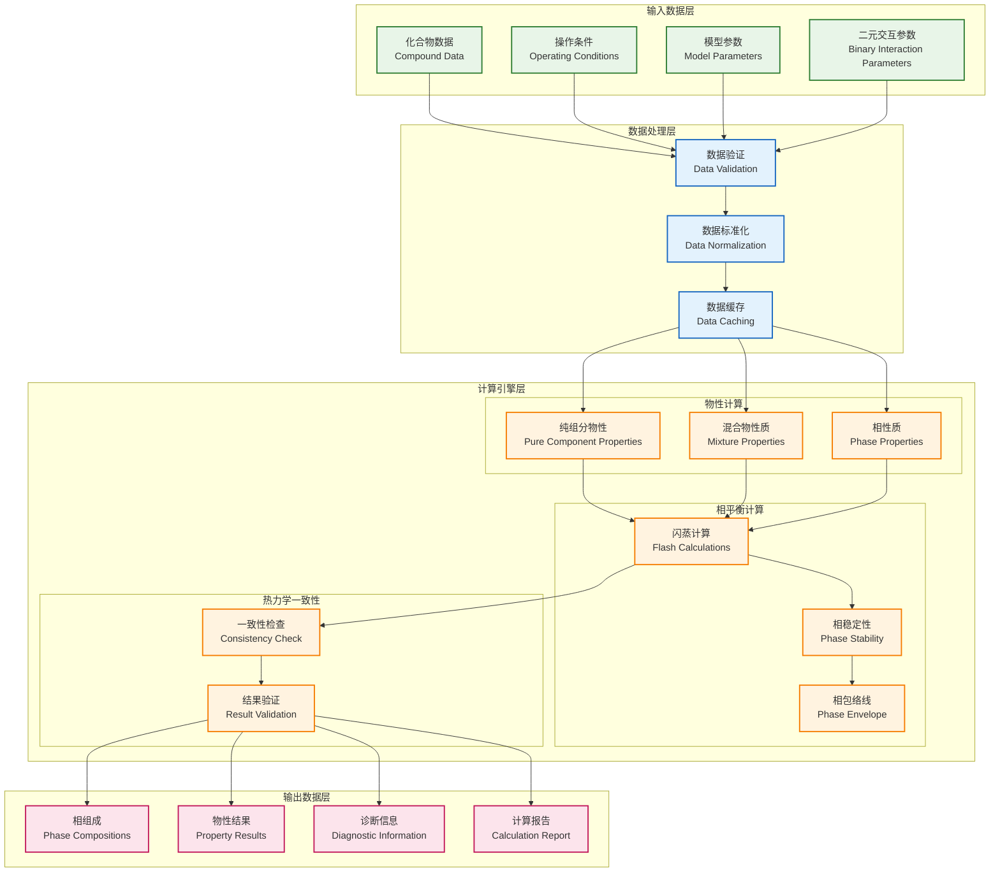

# DWSIM.Thermodynamics 系统架构图
## System Architecture Diagrams for DWSIM.Thermodynamics

**文档版本**: 1.0  
**创建日期**: 2024年12月  
**描述**: DWSIM热力学计算库完整系统架构分析

---

## 1. 总体系统架构图

```mermaid
graph TB
    subgraph "DWSIM.Thermodynamics 核心系统"
        subgraph "用户接口层 (User Interface Layer)"
            UI[Editing Forms]
            EXCEL[Excel Interface]
            CAPEOPEN[CAPE-OPEN Interface]
        end
        
        subgraph "应用程序接口层 (API Layer)"
            THERMO[Thermodynamics.vb<br/>主要API接口]
            SHORTCUTS[ShortcutUtilities.vb<br/>快捷计算工具]
            INTERFACES[Interfaces<br/>标准接口定义]
        end
        
        subgraph "核心计算层 (Core Calculation Layer)"
            subgraph "物性包 (Property Packages)"
                PP_BASE[PropertyPackage.vb<br/>基础物性包 12,044行]
                PP_SRK[SoaveRedlichKwong.vb<br/>SRK状态方程]
                PP_PR[PengRobinson.vb<br/>PR状态方程]
                PP_IDEAL[Ideal.vb<br/>理想气体]
                PP_ACTIVITY[ActivityCoefficientBase.vb<br/>活度系数基类]
                PP_NRTL[NRTL.vb<br/>NRTL模型]
                PP_UNIQUAC[UNIQUAC.vb<br/>UNIQUAC模型]
                PP_UNIFAC[UNIFAC.vb<br/>UNIFAC模型]
                PP_STEAM[SteamTables.vb<br/>水蒸气表]
                PP_COOLPROP[CoolProp.vb<br/>CoolProp接口]
                PP_ELECTROLYTE[ElectrolyteNRTL.vb<br/>电解质NRTL]
                PP_SEAWATER[SeaWater.vb<br/>海水模型]
                PP_BLACKOIL[BlackOil.vb<br/>黑油模型]
            end
            
            subgraph "闪蒸算法 (Flash Algorithms)"
                FLASH_BASE[FlashAlgorithmBase.vb<br/>闪蒸算法基类]
                FLASH_NL[NestedLoops.vb<br/>嵌套循环算法]
                FLASH_IO[BostonBrittInsideOut.vb<br/>Inside-Out算法]
                FLASH_GIBBS[GibbsMinimization3P.vb<br/>Gibbs最小化算法]
                FLASH_3P[NestedLoops3PV3.vb<br/>三相闪蒸算法]
                FLASH_SLE[NestedLoopsSLE.vb<br/>固液平衡算法]
                FLASH_LLE[SimpleLLE.vb<br/>液液平衡算法]
                FLASH_ELECTROLYTE[ElectrolyteSVLE.vb<br/>电解质闪蒸]
            end
        end
        
        subgraph "基础类库层 (Base Classes Layer)"
            BASE_THERMO[ThermodynamicsBase.vb<br/>热力学基础类]
            BASE_MICHELSEN[MichelsenBase.vb<br/>Michelsen相稳定性]
            BASE_PROPERTY[PropertyMethods.vb<br/>物性计算方法]
            BASE_ELECTROLYTE[ElectrolyteProperties.vb<br/>电解质性质]
        end
        
        subgraph "数据和资源层 (Data & Resources Layer)"
            DATABASES[Databases<br/>数据库接口]
            RESOURCES[Resources<br/>资源文件]
            ASSETS[Assets<br/>静态资源]
            LANGUAGES[Languages<br/>多语言支持]
        end
        
        subgraph "辅助工具层 (Helper Classes Layer)"
            HELPERS[Helper Classes<br/>辅助计算类]
            PETROLEUM[PetroleumCharacterization<br/>石油表征]
            MATERIAL[Material Stream<br/>物料流]
        end
    end
    
    subgraph "外部依赖 (External Dependencies)"
        CAPEOPEN_STD[CAPE-OPEN 标准]
        COOLPROP_LIB[CoolProp 库]
        IAPWS[IAPWS-IF97 标准]
        DATABASES_EXT[外部数据库]
    end
    
    %% 连接关系
    UI --> THERMO
    EXCEL --> THERMO
    CAPEOPEN --> THERMO
    
    THERMO --> PP_BASE
    THERMO --> FLASH_BASE
    SHORTCUTS --> PP_BASE
    
    PP_BASE --> BASE_THERMO
    PP_BASE --> BASE_PROPERTY
    FLASH_BASE --> BASE_MICHELSEN
    
    PP_SRK --> PP_BASE
    PP_PR --> PP_BASE
    PP_ACTIVITY --> PP_BASE
    PP_NRTL --> PP_ACTIVITY
    PP_UNIQUAC --> PP_ACTIVITY
    PP_UNIFAC --> PP_ACTIVITY
    
    FLASH_NL --> FLASH_BASE
    FLASH_IO --> FLASH_BASE
    FLASH_GIBBS --> FLASH_BASE
    FLASH_3P --> FLASH_BASE
    
    PP_COOLPROP --> COOLPROP_LIB
    PP_STEAM --> IAPWS
    CAPEOPEN --> CAPEOPEN_STD
    DATABASES --> DATABASES_EXT
    
    classDef coreClass fill:#e1f5fe,stroke:#01579b,stroke-width:2px
    classDef baseClass fill:#f3e5f5,stroke:#4a148c,stroke-width:2px
    classDef algorithmClass fill:#e8f5e8,stroke:#1b5e20,stroke-width:2px
    classDef interfaceClass fill:#fff3e0,stroke:#e65100,stroke-width:2px
    classDef externalClass fill:#fce4ec,stroke:#880e4f,stroke-width:2px
    
    class PP_BASE,FLASH_BASE coreClass
    class BASE_THERMO,BASE_MICHELSEN,BASE_PROPERTY baseClass
    class FLASH_NL,FLASH_IO,FLASH_GIBBS algorithmClass
    class UI,EXCEL,CAPEOPEN interfaceClass
    class COOLPROP_LIB,IAPWS,CAPEOPEN_STD externalClass
```

## 2. 核心模块层次结构图

```mermaid
graph TD
    subgraph "第1层: 接口层"
        A1[Thermodynamics.vb<br/>主接口]
        A2[CAPE-OPEN.vb<br/>标准接口]
        A3[Excel.vb<br/>Excel接口]
        A4[ShortcutUtilities.vb<br/>快捷工具]
    end
    
    subgraph "第2层: 核心抽象层"
        B1[PropertyPackage.vb<br/>物性包基类<br/>12,044行]
        B2[FlashAlgorithmBase.vb<br/>闪蒸算法基类<br/>1,461行]
        B3[ThermodynamicsBase.vb<br/>热力学基础<br/>1,933行]
        B4[MichelsenBase.vb<br/>相稳定性基础<br/>2,933行]
    end
    
    subgraph "第3层: 状态方程层"
        C1[SoaveRedlichKwong.vb<br/>SRK方程<br/>1,121行]
        C2[PengRobinson.vb<br/>PR方程<br/>1,073行]
        C3[PengRobinsonStryjekVera2.vb<br/>PRSV方程<br/>867行]
        C4[LeeKeslerPlocker.vb<br/>LKP方程<br/>671行]
        C5[Ideal.vb<br/>理想气体<br/>797行]
    end
    
    subgraph "第4层: 活度系数层"
        D1[ActivityCoefficientBase.vb<br/>活度系数基类<br/>1,043行]
        D2[NRTL.vb<br/>NRTL模型<br/>102行]
        D3[UNIQUAC.vb<br/>UNIQUAC模型<br/>128行]
        D4[UNIFAC.vb<br/>UNIFAC模型<br/>136行]
        D5[ExtendedUNIQUAC.vb<br/>扩展UNIQUAC<br/>645行]
    end
    
    subgraph "第5层: 闪蒸算法层"
        E1[NestedLoops.vb<br/>嵌套循环<br/>2,396行]
        E2[BostonBrittInsideOut.vb<br/>Inside-Out<br/>2,312行]
        E3[GibbsMinimization3P.vb<br/>Gibbs最小化<br/>1,994行]
        E4[NestedLoops3PV3.vb<br/>三相闪蒸<br/>2,059行]
        E5[NestedLoopsSLE.vb<br/>固液平衡<br/>2,210行]
        E6[SimpleLLE.vb<br/>液液平衡<br/>1,202行]
    end
    
    subgraph "第6层: 专用模型层"
        F1[SteamTables.vb<br/>水蒸气表<br/>1,229行]
        F2[CoolProp.vb<br/>CoolProp接口<br/>1,962行]
        F3[ElectrolyteNRTL.vb<br/>电解质NRTL<br/>641行]
        F4[SeaWater.vb<br/>海水模型<br/>776行]
        F5[BlackOil.vb<br/>黑油模型<br/>810行]
        F6[SourWater.vb<br/>酸性水<br/>299行]
    end
    
    %% 层次依赖关系
    A1 --> B1
    A1 --> B2
    A2 --> B1
    A3 --> B1
    A4 --> B1
    
    B1 --> B3
    B1 --> B4
    B2 --> B4
    
    B1 --> C1
    B1 --> C2
    B1 --> C3
    B1 --> C4
    B1 --> C5
    
    B1 --> D1
    D1 --> D2
    D1 --> D3
    D1 --> D4
    D1 --> D5
    
    B2 --> E1
    B2 --> E2
    B2 --> E3
    B2 --> E4
    B2 --> E5
    B2 --> E6
    
    B1 --> F1
    B1 --> F2
    B1 --> F3
    B1 --> F4
    B1 --> F5
    B1 --> F6
    
    classDef layer1 fill:#ffebee,stroke:#c62828,stroke-width:2px
    classDef layer2 fill:#e8eaf6,stroke:#3f51b5,stroke-width:2px
    classDef layer3 fill:#e0f2f1,stroke:#00695c,stroke-width:2px
    classDef layer4 fill:#fff3e0,stroke:#ef6c00,stroke-width:2px
    classDef layer5 fill:#f3e5f5,stroke:#7b1fa2,stroke-width:2px
    classDef layer6 fill:#e1f5fe,stroke:#0277bd,stroke-width:2px
    
    class A1,A2,A3,A4 layer1
    class B1,B2,B3,B4 layer2
    class C1,C2,C3,C4,C5 layer3
    class D1,D2,D3,D4,D5 layer4
    class E1,E2,E3,E4,E5,E6 layer5
    class F1,F2,F3,F4,F5,F6 layer6
```

## 3. 数据流架构图

## 4. 算法模块详细分类图

```mermaid
erDiagram
    DWSIM_Thermodynamics ||--o{ 状态方程算法 : contains
    DWSIM_Thermodynamics ||--o{ 活度系数算法 : contains
    DWSIM_Thermodynamics ||--o{ 闪蒸算法 : contains
    DWSIM_Thermodynamics ||--o{ 专用模型 : contains
    DWSIM_Thermodynamics ||--o{ 数值算法 : contains
    
    状态方程算法 ||--o{ 立方状态方程 : includes
    状态方程算法 ||--o{ 非立方状态方程 : includes
    状态方程算法 ||--o{ 理想气体 : includes
    
    立方状态方程 ||--|| Soave_Redlich_Kwong : implements
    立方状态方程 ||--|| Peng_Robinson : implements
    立方状态方程 ||--|| Peng_Robinson_Stryjek_Vera : implements
    立方状态方程 ||--|| Lee_Kesler_Plocker : implements
    
    非立方状态方程 ||--|| Benedict_Webb_Rubin : implements
    非立方状态方程 ||--|| Virial方程 : implements
    
    理想气体 ||--|| 理想气体状态方程 : implements
    
    活度系数算法 ||--o{ 局部组成模型 : includes
    活度系数算法 ||--o{ 基团贡献法 : includes
    活度系数算法 ||--o{ 经验关联式 : includes
    
    局部组成模型 ||--|| NRTL : implements
    局部组成模型 ||--|| UNIQUAC : implements
    局部组成模型 ||--|| Extended_UNIQUAC : implements
    
    基团贡献法 ||--|| UNIFAC : implements
    基团贡献法 ||--|| UNIFAC_LL : implements
    基团贡献法 ||--|| MODFAC : implements
    基团贡献法 ||--|| NIST_MFAC : implements
    
    经验关联式 ||--|| Wilson : implements
    经验关联式 ||--|| Margules : implements
    经验关联式 ||--|| Van_Laar : implements
    
    闪蒸算法 ||--o{ 两相闪蒸 : includes
    闪蒸算法 ||--o{ 三相闪蒸 : includes
    闪蒸算法 ||--o{ 特殊闪蒸 : includes
    
    两相闪蒸 ||--|| 嵌套循环法 : implements
    两相闪蒸 ||--|| Inside_Out法 : implements
    两相闪蒸 ||--|| Boston_Britt法 : implements
    
    三相闪蒸 ||--|| 三相嵌套循环 : implements
    三相闪蒸 ||--|| Gibbs最小化 : implements
    三相闪蒸 ||--|| Boston_Fournier法 : implements
    
    特殊闪蒸 ||--|| 固液平衡SLE : implements
    特殊闪蒸 ||--|| 液液平衡LLE : implements
    特殊闪蒸 ||--|| 电解质SVLE : implements
    
    专用模型 ||--o{ 水和蒸汽 : includes
    专用模型 ||--o{ 制冷剂 : includes
    专用模型 ||--o{ 电解质 : includes
    专用模型 ||--o{ 石油工业 : includes
    
    水和蒸汽 ||--|| IAPWS_IF97 : implements
    水和蒸汽 ||--|| Steam_Tables : implements
    
    制冷剂 ||--|| CoolProp接口 : implements
    制冷剂 ||--|| 不可压缩流体 : implements
    
    电解质 ||--|| 电解质NRTL : implements
    电解质 ||--|| Pitzer模型 : implements
    
    石油工业 ||--|| 黑油模型 : implements
    石油工业 ||--|| 酸性水模型 : implements
    石油工业 ||--|| 海水模型 : implements
    
    数值算法 ||--o{ 方程求解 : includes
    数值算法 ||--o{ 优化算法 : includes
    数值算法 ||--o{ 稳定性分析 : includes
    
    方程求解 ||--|| Newton_Raphson : implements
    方程求解 ||--|| Brent方法 : implements
    方程求解 ||--|| Secant方法 : implements
    
    优化算法 ||--|| BFGS : implements
    优化算法 ||--|| Levenberg_Marquardt : implements
    优化算法 ||--|| 遗传算法 : implements
    
    稳定性分析 ||--|| Michelsen_TPD : implements
    稳定性分析 ||--|| 相分离检测 : implements
    稳定性分析 ||--|| 临界点计算 : implements
```

---

## 架构设计原则

### 1. 分层架构原则
- **接口层**: 提供统一的API接口
- **抽象层**: 定义核心抽象类和接口
- **实现层**: 具体算法和模型实现
- **数据层**: 数据存储和管理

### 2. 模块化设计
- **高内聚**: 每个模块功能单一明确
- **低耦合**: 模块间依赖关系清晰
- **可扩展**: 支持新算法和模型的添加
- **可维护**: 代码结构清晰易于维护

### 3. 性能优化
- **数据缓存**: 避免重复计算
- **算法选择**: 根据问题特征选择最优算法
- **并行计算**: 支持多线程和分布式计算
- **内存管理**: 高效的内存使用策略

### 4. 质量保证
- **错误处理**: 完善的异常处理机制
- **数据验证**: 输入输出数据验证
- **单元测试**: 全面的测试覆盖
- **性能监控**: 实时性能监控和分析

---

**文档状态**: ✅ 完成  
**最后更新**: 2024年12月  
**维护者**: OpenAspen项目组 