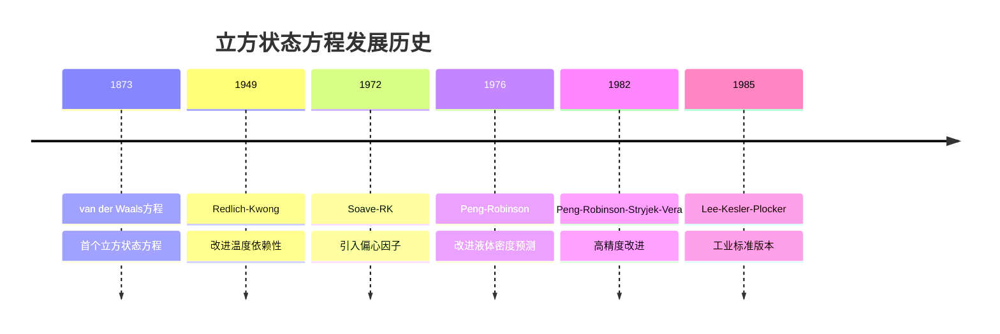

# 立方状态方程技术手册

**文档版本**: 2.0  
**创建日期**: 2024年12月  
**作者**: OpenAspen项目组  
**适用范围**: 工程计算、科学研究、工业应用  

---

## 📋 目录

1. [概述](#概述)
2. [通用立方状态方程形式](#通用立方状态方程形式)
3. [经典立方方程](#经典立方方程)
4. [改进立方方程](#改进立方方程)
5. [混合规则](#混合规则)
6. [数值求解方法](#数值求解方法)
7. [应用指南](#应用指南)
8. [实现示例](#实现示例)

---

## 📖 概述

立方状态方程是热力学计算中最重要的工具之一，它们在保持数学简洁性的同时提供了合理的精度。本文档详细介绍了DWSIM热力学库中实现的各种立方状态方程。

### 历史发展



### 适用范围对比

| 方程类型 | 温度范围 [K] | 压力范围 [bar] | 精度等级 | 主要应用 |
|----------|-------------|----------------|----------|----------|
| **van der Waals** | 200-600 | 1-50 | 中等 | 教学研究 |
| **Redlich-Kwong** | 250-800 | 1-100 | 良好 | 轻烃系统 |
| **Soave-RK** | 200-800 | 0.1-200 | 良好 | 工程计算 |
| **Peng-Robinson** | 150-1000 | 0.001-500 | 优秀 | 工业标准 |
| **PRSV** | 200-1200 | 0.001-1000 | 优秀 | 高精度需求 |
| **Lee-Kesler-Plocker** | 150-800 | 0.001-200 | 优秀 | 天然气工业 |

---

## �� 通用立方状态方程形式

所有立方状态方程都可以表示为通用形式：

$$P = \frac{RT}{V-b} - \frac{a(T)}{V^2 + ubV + wb^2}$$

其中：
- $P$: 压力 [Pa]
- $R$: 气体常数 = 8.314 J/(mol·K)
- $T$: 温度 [K]  
- $V$: 摩尔体积 [m³/mol]
- $a(T)$: 吸引力参数 [Pa·m⁶/mol²]
- $b$: 排斥体积参数 [m³/mol]
- $u, w$: 方程特征参数

### 通用参数关系

不同方程的特征参数：

| 方程 | $u$ | $w$ | 临界压缩因子 $Z_c$ |
|------|-----|-----|-------------------|
| **van der Waals** | 0 | 0 | 0.375 |
| **RK/SRK** | 1 | 0 | 0.333 |
| **PR/PRSV** | 2 | -1 | 0.307 |

### 立方形式转换

将压力形式转换为压缩因子立方方程：

$$Z^3 + \alpha Z^2 + \beta Z + \gamma = 0$$

其中：
$$\alpha = -(1-B)$$
$$\beta = A - uB - uB^2$$  
$$\gamma = -AB + wB^2 + wB^3$$

参数定义：
$$A = \frac{aP}{(RT)^2}, \quad B = \frac{bP}{RT}$$

---

## 🔬 经典立方方程

### 1. van der Waals方程 (1873)

**基本形式**:
$$\left(P + \frac{a}{V^2}\right)(V-b) = RT$$

**临界常数关系**:
$$a = \frac{27R^2T_c^2}{64P_c}, \quad b = \frac{RT_c}{8P_c}$$

**特点**:
- 历史第一个立方状态方程
- 定性正确但定量精度不高
- 主要用于教学和概念理解

**Python实现**:
```python
class VanDerWaals(PropertyPackage):
    def _calculate_eos_parameters(self, T, P, x):
        a = 27 * (8.314 * self.Tc)**2 / (64 * self.Pc)  # 常数
        b = 8.314 * self.Tc / (8 * self.Pc)
        return a, b
```

### 2. Redlich-Kwong方程 (1949)

**基本形式**:
$$P = \frac{RT}{V-b} - \frac{a}{\sqrt{T}V(V+b)}$$

**参数表达式**:
$$a = 0.42748\frac{R^2T_c^{2.5}}{P_c}, \quad b = 0.08664\frac{RT_c}{P_c}$$

**温度依赖性**:
$$a(T) = a_c \cdot T^{-0.5}$$

**特点**:
- 引入温度依赖性
- 对气相性质预测较好
- 液相密度精度有限

### 3. Soave-Redlich-Kwong方程 (1972)

**改进的温度函数**:
$$a(T) = a_c \cdot \alpha(T_r, \omega)$$

$$\alpha = [1 + m(1-\sqrt{T_r})]^2$$

$$m = 0.480 + 1.574\omega - 0.176\omega^2$$

其中 $T_r = T/T_c$ 是对比温度，$\omega$ 是偏心因子。

**偏心因子定义**:
$$\omega = -\log_{10}(P_r^{sat}|_{T_r=0.7}) - 1$$

**改进效果**:
- 考虑分子非球形性
- 显著改善饱和性质预测
- 广泛用于工程计算

**Python实现**:
```python
def _calculate_alpha_srk(self, T, Tc, omega):
    Tr = T / Tc
    m = 0.480 + 1.574*omega - 0.176*omega**2
    alpha = (1 + m*(1 - np.sqrt(Tr)))**2
    return alpha
```

---

## 🚀 改进立方方程

### 1. Peng-Robinson方程 (1976)

**基本形式**:
$$P = \frac{RT}{V-b} - \frac{a(T)}{V(V+b) + b(V-b)}$$

**临界参数**:
$$a_c = 0.45724\frac{R^2T_c^2}{P_c}, \quad b = 0.07780\frac{RT_c}{P_c}$$

**温度函数**:
$$\alpha = [1 + \kappa(1-\sqrt{T_r})]^2$$

$$\kappa = 0.37464 + 1.54226\omega - 0.26992\omega^2$$

**主要优势**:
- 改善液体密度预测
- 更好的相平衡计算
- 成为工业标准

**立方方程系数**:
- $u = 2, w = -1$
- $Z_c = 0.307$

### 2. Peng-Robinson-Stryjek-Vera (PRSV)

**PRSV1改进**:
$$\kappa = \kappa_0 + \kappa_1(1+\sqrt{T_r})(0.7-T_r)$$

其中：
$$\kappa_0 = 0.378893 + 1.4897153\omega - 0.17131848\omega^2 + 0.0196554\omega^3$$

**PRSV2 (超临界条件)**:
当 $T_r > 1$ 时：
$$\alpha = \exp[2(1+\kappa)(1-T_r^{0.5})]$$

**参数拟合**:
$\kappa_1$ 通常需要实验数据拟合，典型值范围：
- 轻烃: $\kappa_1 = -0.05$ 到 $0.05$
- 重烃: $\kappa_1 = 0.05$ 到 $0.15$
- 极性物质: $\kappa_1 = -0.1$ 到 $0.1$

**精度提升**:
- 高温条件下精度显著改善  
- 重组分和极性物质处理更好
- 保持PR方程的所有优点

### 3. Lee-Kesler-Plocker (LKP)

**特殊的α函数**:
对于 $\omega \leq 0.491$:
$$m = 0.37464 + 1.54226\omega - 0.26992\omega^2$$

对于 $\omega > 0.491$:
$$m = 0.3796 + 1.485\omega - 0.1644\omega^2 + 0.01667\omega^3$$

**工业应用特点**:
- 针对天然气系统优化
- 在轻烃范围内精度极高
- 广泛用于天然气处理

---

## 🔗 混合规则

### 1. van der Waals混合规则

**基本形式**:
$$a_{mix} = \sum_i \sum_j x_i x_j a_{ij}$$
$$b_{mix} = \sum_i x_i b_i$$

**组合规则**:
$$a_{ij} = \sqrt{a_i a_j}(1-k_{ij})$$

其中 $k_{ij}$ 是二元交互参数。

### 2. 二元交互参数估算

**经验关联**:

对于烷烃-烷烃系统：
$$k_{ij} = 0$$

对于水-烷烃系统：
$$k_{ij} = 0.48 + 0.0015T - 2.7 \times 10^{-6}T^2$$

对于CO₂-烷烃系统：
$$k_{ij} = 0.12 - 0.0001T$$

### 3. 高级混合规则

**Wong-Sandler混合规则**:
结合状态方程和活度系数模型：

$$\frac{a_{mix}}{b_{mix}RT} = \sum_i x_i \frac{a_i}{b_i RT} + \frac{1}{C_2} \left(\frac{G^E}{RT} - \sum_i x_i \ln\frac{b_{mix}}{b_i}\right)$$

其中 $G^E$ 是超额Gibbs自由能。

---

## 🔢 数值求解方法

### 1. 立方方程求解

**Cardano方法**:
对于一般立方方程 $z^3 + pz + q = 0$：

判别式：
$$\Delta = -4p^3 - 27q^2$$

当 $\Delta > 0$ 时有三个实根：
$$z_k = 2\sqrt{-\frac{p}{3}}\cos\left(\frac{1}{3}\arccos\left(\frac{3q}{2p}\sqrt{-\frac{3}{p}}\right) - \frac{2\pi k}{3}\right)$$

其中 $k = 0, 1, 2$。

**Python实现**:
```python
def solve_cubic_cardano(coeffs):
    """使用Cardano方法求解立方方程"""
    a, b, c, d = coeffs
    
    # 转换为标准形式 z^3 + pz + q = 0
    p = (3*a*c - b**2) / (3*a**2)
    q = (2*b**3 - 9*a*b*c + 27*a**2*d) / (27*a**3)
    
    discriminant = -4*p**3 - 27*q**2
    
    if discriminant > 0:
        # 三个实根
        m = 2 * np.sqrt(-p/3)
        theta = np.arccos(3*q/(2*p) * np.sqrt(-3/p)) / 3
        
        roots = [
            m * np.cos(theta),
            m * np.cos(theta - 2*np.pi/3),
            m * np.cos(theta - 4*np.pi/3)
        ]
    else:
        # 一个实根，两个复根
        # ... 复数计算逻辑
        pass
    
    # 变换回原方程的根
    roots = [z - b/(3*a) for z in roots]
    return roots
```

### 2. 根的选择准则

**相态判断**:
- **气相**: 选择最大的实根
- **液相**: 选择最小的正实根
- **超临界**: 唯一实根

**数值稳定性检查**:
```python
def select_physical_root(roots, phase, B):
    """选择物理意义的根"""
    real_roots = [r.real for r in roots if abs(r.imag) < 1e-10]
    
    if phase == Phase.VAPOR:
        return max(real_roots)
    else:
        # 液相根必须大于B
        valid_roots = [r for r in real_roots if r > B + 1e-10]
        if valid_roots:
            return min(valid_roots)
        else:
            raise ValueError("No valid liquid root found")
```

### 3. 收敛性改进

**Halley方法**:
对于改善收敛性，可使用三阶收敛的Halley方法：

$$z_{n+1} = z_n - \frac{2f(z_n)f'(z_n)}{2[f'(z_n)]^2 - f(z_n)f''(z_n)}$$

---

## 📊 应用指南

### 1. 方程选择准则

**系统类型推荐**:

| 系统类型 | 推荐方程 | 原因 |
|----------|----------|------|
| **轻烃气体** | SRK, LKP | 高精度，计算快速 |
| **重烃液体** | PR, PRSV | 良好的液体密度 |
| **极性系统** | PRSV | 改进的温度函数 |
| **高压系统** | PR, PRSV | 宽压力范围适用 |
| **天然气** | LKP | 工业标准 |
| **石油分馏** | PR | 工业验证充分 |

### 2. 参数获取策略

**临界性质**:
- 优先使用实验数据
- 次选可靠的估算方法 (Joback, Lee-Kesler)
- 对于假想组分使用关联式

**偏心因子**:
- 从蒸汽压数据计算
- 使用可靠数据库 (DIPPR, NIST)
- 估算方法作为备选

**二元参数**:
- 实验拟合值最佳
- 基于相似性估算
- 默认值作为初始猜值

### 3. 计算精度评估

**典型误差范围**:

| 性质 | SRK | PR | PRSV |
|------|-----|----|----- |
| **气相密度** | ±2% | ±1.5% | ±1% |
| **液相密度** | ±5% | ±2% | ±1.5% |
| **蒸汽压** | ±3% | ±2% | ±1% |
| **焓** | ±5% | ±3% | ±2% |

---

## 💻 实现示例

### 完整的PR方程实现

```python
class PengRobinson(PropertyPackage):
    """完整的Peng-Robinson状态方程实现"""
    
    def __init__(self, compounds):
        super().__init__(compounds, "Peng-Robinson")
        self.binary_parameters = {}
        
    def calculate_eos_parameters(self, T, P, x):
        """计算状态方程参数"""
        n_comp = len(x)
        
        # 纯组分参数
        a_pure, b_pure = self._calculate_pure_parameters(T)
        
        # 混合规则
        a_mix = 0.0
        b_mix = 0.0
        
        for i in range(n_comp):
            b_mix += x[i] * b_pure[i]
            
            for j in range(n_comp):
                kij = self._get_binary_parameter(i, j)
                aij = np.sqrt(a_pure[i] * a_pure[j]) * (1 - kij)
                a_mix += x[i] * x[j] * aij
                
        return a_mix, b_mix
        
    def _calculate_pure_parameters(self, T):
        """计算纯组分参数"""
        n_comp = len(self.compounds)
        a_pure = np.zeros(n_comp)
        b_pure = np.zeros(n_comp)
        
        for i, compound in enumerate(self.compounds):
            props = self.get_compound_properties(compound)
            
            Tc = props['critical_temperature']
            Pc = props['critical_pressure'] 
            omega = props['acentric_factor']
            
            # PR方程常数
            R = 8.314
            ac = 0.45724 * (R * Tc)**2 / Pc
            bc = 0.07780 * R * Tc / Pc
            
            # 温度依赖项
            Tr = T / Tc
            kappa = 0.37464 + 1.54226*omega - 0.26992*omega**2
            alpha = (1 + kappa*(1 - np.sqrt(Tr)))**2
            
            a_pure[i] = ac * alpha
            b_pure[i] = bc
            
        return a_pure, b_pure
        
    def calculate_compressibility_factor(self, T, P, x, phase):
        """计算压缩因子"""
        a, b = self.calculate_eos_parameters(T, P, x)
        
        # 无量纲参数
        R = 8.314
        A = a * P / (R * T)**2
        B = b * P / (R * T)
        
        # 立方方程系数
        coeffs = [1, -(1-B), A-3*B**2-2*B, -(A*B-B**2-B**3)]
        
        # 求解并选择根
        roots = solve_cubic(coeffs)
        return select_physical_root(roots, phase, B)
        
    def calculate_fugacity_coefficient(self, T, P, x, phase):
        """计算逸度系数"""
        n_comp = len(x)
        
        # 计算基本参数
        a, b = self.calculate_eos_parameters(T, P, x)
        Z = self.calculate_compressibility_factor(T, P, x, phase)
        
        R = 8.314
        A = a * P / (R * T)**2
        B = b * P / (R * T)
        
        # 计算每个组分的逸度系数
        phi = np.zeros(n_comp)
        
        for i in range(n_comp):
            # 计算偏导数
            dadi, dbdi = self._calculate_partial_derivatives(i, T, x)
            
            # PR逸度系数公式
            ln_phi = (
                (Z - 1) * dbdi/b - np.log(Z - B) -
                A/(2*np.sqrt(2)*B) * (2*dadi/a - dbdi/b) *
                np.log((Z + (1+np.sqrt(2))*B)/(Z + (1-np.sqrt(2))*B))
            )
            
            phi[i] = np.exp(ln_phi)
            
        return phi
```

### 使用示例

```python
# 创建组分列表
compounds = ['methane', 'ethane', 'propane']

# 初始化PR方程
pr = PengRobinson(compounds)

# 设置二元参数 (可选)
pr.set_binary_parameter('methane', 'ethane', 0.0)

# 计算条件
T = 300.0  # K
P = 10.0   # bar
x = np.array([0.5, 0.3, 0.2])

# 计算性质
Z_vapor = pr.calculate_compressibility_factor(T, P, x, Phase.VAPOR)
phi_vapor = pr.calculate_fugacity_coefficient(T, P, x, Phase.VAPOR)

print(f"气相压缩因子: {Z_vapor:.4f}")
print(f"气相逸度系数: {phi_vapor}")
```

---

## 📚 参考文献

1. **Peng, D.-Y., Robinson, D.B.** (1976). "A new two-constant equation of state." *Industrial & Engineering Chemistry Fundamentals*, 15(1), 59-64.

2. **Stryjek, R., Vera, J.H.** (1986). "PRSV: An improved Peng-Robinson equation of state for pure compounds and mixtures." *The Canadian Journal of Chemical Engineering*, 64(2), 323-333.

3. **Poling, B.E., Prausnitz, J.M., O'Connell, J.P.** (2001). *The Properties of Gases and Liquids* (5th ed.). McGraw-Hill.

4. **Michelsen, M.L., Mollerup, J.M.** (2007). *Thermodynamic Models: Fundamentals & Computational Aspects* (2nd ed.). Tie-Line Publications.

---

**文档状态**: ✅ **完成**  
**最后更新**: 2024年12月  
**维护者**: OpenAspen项目组  
