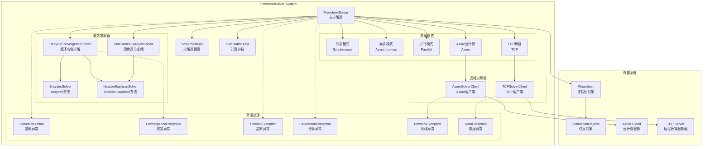
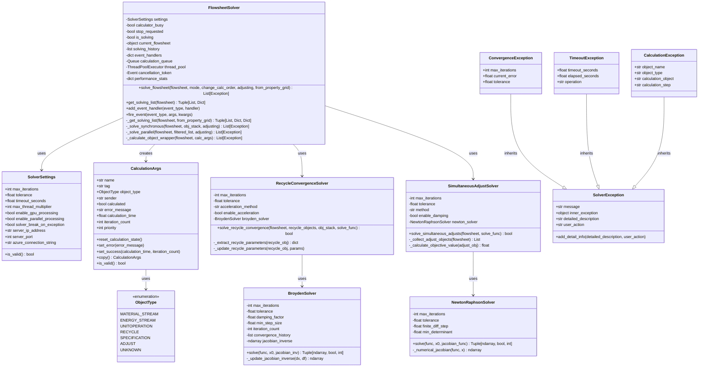
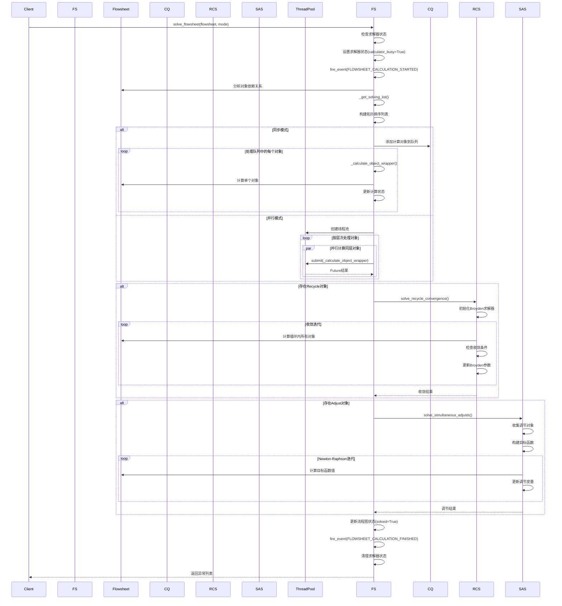
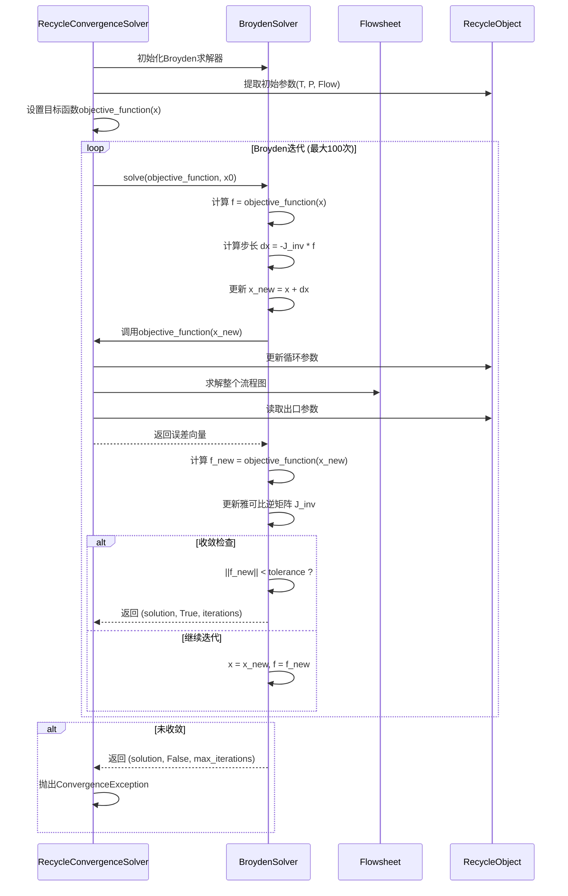
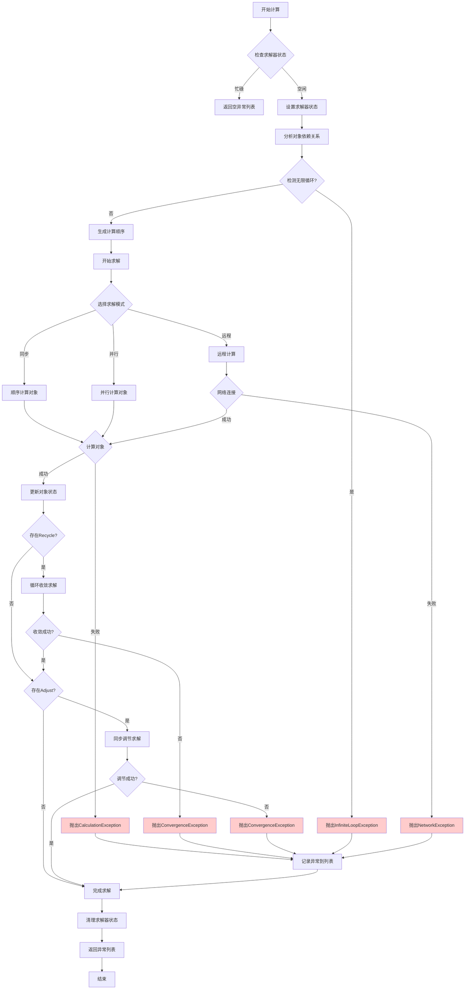

# DWSIM5 FlowsheetSolver - 流程图求解器

## 项目概述

DWSIM5 FlowsheetSolver 是一个用于化工流程图求解的 Python 模块，从原 VB.NET 版本 1:1 转换实现。该模块提供了完整的流程图求解功能，包括：

- 📊 **流程图求解**: 支持同步、异步、并行、远程等多种求解模式
- 🔄 **循环收敛求解**: 实现 Broyden、Newton-Raphson 等收敛算法
- 🌐 **远程计算支持**: 支持 Azure 云计算和 TCP 网络计算
- ⚙️ **拓扑排序算法**: 智能分析对象依赖关系，确定最优计算顺序
- 📈 **性能监控**: 提供详细的性能统计和事件系统

## 目录结构

```
flowsheet_solver/
├── __init__.py                 # 模块初始化，提供延迟导入机制
├── solver.py                   # 主求解器类 (50KB, 1336行)
├── calculation_args.py         # 计算参数类定义 (5.3KB, 191行)
├── solver_exceptions.py        # 异常类定义 (5.4KB, 157行)
├── convergence_solver.py       # 收敛求解器 (19KB, 559行)
├── remote_solvers/            # 远程求解器
│   ├── __init__.py
│   ├── azure_solver_client.py  # Azure云计算客户端
│   └── tcp_solver_client.py    # TCP网络客户端
└── task_schedulers/           # 任务调度器（待实现）
```

## 系统架构图



## 核心类图



## 流程图求解时序图



## 收敛算法时序图



## 异常处理流程图



## 测试用例图

```mermaid
graph TD
    subgraph "FlowsheetSolver 测试用例"
        T1[test_solver_initialization<br/>求解器初始化测试]
        T2[test_solve_flowsheet_sync<br/>同步求解测试]
        T3[test_solve_flowsheet_parallel<br/>并行求解测试]
        T4[test_get_solving_list<br/>求解列表生成测试]
        T5[test_event_system<br/>事件系统测试]
        T6[test_performance_stats<br/>性能统计测试]
        T7[test_cancellation<br/>取消操作测试]
        T8[test_timeout_handling<br/>超时处理测试]
    end
  
    subgraph "CalculationArgs 测试用例"
        T9[test_calculation_args_creation<br/>参数创建测试]
        T10[test_calculation_args_validation<br/>参数验证测试]
        T11[test_calculation_args_state<br/>状态管理测试]
        T12[test_object_type_enum<br/>对象类型枚举测试]
    end
  
    subgraph "收敛求解器测试用例"
        T13[test_broyden_solver_simple<br/>Broyden简单函数测试]
        T14[test_broyden_solver_convergence<br/>Broyden收敛性测试]
        T15[test_newton_raphson_solver<br/>Newton-Raphson测试]
        T16[test_recycle_convergence<br/>循环收敛测试]
        T17[test_simultaneous_adjust<br/>同步调节测试]
    end
  
    subgraph "异常处理测试用例"
        T18[test_solver_exceptions<br/>基础异常测试]
        T19[test_convergence_exception<br/>收敛异常测试]
        T20[test_timeout_exception<br/>超时异常测试]
        T21[test_calculation_exception<br/>计算异常测试]
        T22[test_network_exception<br/>网络异常测试]
        T23[test_infinite_loop_detection<br/>无限循环检测测试]
    end
  
    subgraph "远程求解器测试用例"
        T24[test_azure_solver_client<br/>Azure客户端测试]
        T25[test_tcp_solver_client<br/>TCP客户端测试]
        T26[test_remote_solver_timeout<br/>远程求解器超时测试]
        T27[test_network_failure_handling<br/>网络故障处理测试]
    end
  
    subgraph "集成测试用例"
        T28[test_complete_flowsheet_solve<br/>完整流程图求解测试]
        T29[test_complex_recycle_loops<br/>复杂循环流程测试]
        T30[test_mixed_solver_modes<br/>混合求解模式测试]
        T31[test_large_flowsheet_performance<br/>大型流程图性能测试]
    end
  
    T1 --> T2
    T2 --> T3
    T3 --> T4
    T4 --> T5
  
    T9 --> T10
    T10 --> T11
    T11 --> T12
  
    T13 --> T14
    T14 --> T15
    T15 --> T16
    T16 --> T17
  
    T18 --> T19
    T19 --> T20
    T20 --> T21
    T21 --> T22
    T22 --> T23
  
    T24 --> T25
    T25 --> T26
    T26 --> T27
  
    T28 --> T29
    T29 --> T30
    T30 --> T31
  
    style T1 fill:#e1f5fe
    style T9 fill:#f3e5f5
    style T13 fill:#e8f5e8
    style T18 fill:#fff3e0
    style T24 fill:#fce4ec
    style T28 fill:#f1f8e9
```



## 主要特性

### 1. 多种求解模式

- **同步模式**: 在主线程中顺序计算所有对象
- **异步模式**: 在后台线程中异步计算
- **并行模式**: 使用多线程并行计算同一层次的对象
- **Azure模式**: 利用Azure云计算服务进行分布式计算
- **TCP模式**: 通过TCP网络连接远程计算服务器

### 2. 智能拓扑排序

- 自动分析对象间的依赖关系
- 检测和处理循环依赖
- 生成最优的计算顺序
- 支持从终点对象逆向追踪

### 3. 高级收敛算法

- **Broyden方法**: 拟牛顿方法，适用于一般非线性方程组
- **Newton-Raphson方法**: 经典牛顿法，收敛速度快
- **循环收敛求解**: 专门处理Recycle对象的收敛问题
- **同步调节求解**: 处理Adjust对象的同时调节

### 4. 完善的异常处理

- 分层异常体系，便于问题诊断
- 详细的错误信息和用户操作建议
- 支持异常链追踪
- 无限循环检测和超时保护

### 5. 性能监控和事件系统

- 实时性能统计
- 可扩展的事件系统
- 计算历史记录
- 支持取消操作

## 使用示例

### 基本使用

```python
from flowsheet_solver import FlowsheetSolver, SolverSettings

# 创建求解器设置
settings = SolverSettings(
    max_iterations=100,
    tolerance=1e-6,
    enable_parallel_processing=True
)

# 创建求解器
solver = FlowsheetSolver(settings)

# 求解流程图
exceptions = solver.solve_flowsheet(flowsheet, mode=0)  # 同步模式

if not exceptions:
    print("流程图求解成功!")
else:
    print(f"求解过程中发生 {len(exceptions)} 个异常")
```

### 添加事件处理器

```python
def on_calculation_started(flowsheet):
    print(f"开始计算流程图: {flowsheet.name}")

def on_object_calculating(calc_args):
    print(f"正在计算对象: {calc_args.name}")

solver.add_event_handler("flowsheet_calculation_started", on_calculation_started)
solver.add_event_handler("calculating_object", on_object_calculating)
```

### 使用收敛求解器

```python
from flowsheet_solver import BroydenSolver
import numpy as np

# 定义目标函数
def objective_function(x):
    return np.array([x[0]**2 + x[1]**2 - 1, x[0] - x[1]])

# 创建Broyden求解器
broyden = BroydenSolver(max_iterations=50, tolerance=1e-8)

# 求解
x0 = np.array([0.5, 0.5])
solution, converged, iterations = broyden.solve(objective_function, x0)

if converged:
    print(f"收敛成功! 解: {solution}, 迭代次数: {iterations}")
```

## API 参考

### FlowsheetSolver

主要的流程图求解器类，提供完整的求解功能。

#### 初始化

```python
FlowsheetSolver(settings: Optional[SolverSettings] = None)
```

#### 主要方法

- `solve_flowsheet(flowsheet, mode, change_calc_order, adjusting, from_property_grid)`: 求解流程图
- `get_solving_list(flowsheet)`: 获取对象求解列表
- `add_event_handler(event_type, handler)`: 添加事件处理器
- `fire_event(event_type, *args, **kwargs)`: 触发事件

### SolverSettings

求解器配置类，包含所有求解参数。

#### 主要属性

- `max_iterations: int`: 最大迭代次数
- `tolerance: float`: 收敛容差
- `timeout_seconds: float`: 超时时间
- `enable_parallel_processing: bool`: 是否启用并行处理
- `server_ip_address: str`: 远程服务器地址
- `server_port: int`: 服务器端口

### CalculationArgs

计算参数类，封装对象计算信息。

#### 主要属性

- `name: str`: 对象名称
- `object_type: ObjectType`: 对象类型
- `calculated: bool`: 是否已计算
- `error_message: str`: 错误信息
- `calculation_time: float`: 计算耗时

## 依赖要求

```
numpy >= 1.20.0
scipy >= 1.7.0
```

## 核心算法详解

### 1. 拓扑排序算法

#### 算法原理

拓扑排序用于确定流程图中对象的计算顺序，确保每个对象在计算前其所有依赖的对象都已完成计算。

#### 数学模型

设流程图为有向图 $G = (V, E)$，其中：
- $V = \{v_1, v_2, ..., v_n\}$ 表示所有仿真对象
- $E \subseteq V \times V$ 表示对象间的依赖关系

对于边 $(v_i, v_j) \in E$，表示对象 $v_j$ 依赖于对象 $v_i$。

#### 算法步骤

1. **计算入度**: 对每个节点 $v_i$，计算其入度 $\text{indegree}(v_i) = |\{v_j : (v_j, v_i) \in E\}|$

2. **初始化队列**: $Q = \{v_i : \text{indegree}(v_i) = 0\}$

3. **迭代处理**:
   ```
   while Q ≠ ∅ do
       v ← dequeue(Q)
       add v to topological_order
       for each (v, u) ∈ E do
           indegree(u) ← indegree(u) - 1
           if indegree(u) = 0 then
               enqueue(Q, u)
   ```

4. **循环检测**: 如果 $|\text{topological\_order}| < |V|$，则存在循环依赖

#### 时间复杂度

- 时间复杂度: $O(|V| + |E|)$
- 空间复杂度: $O(|V|)$

### 2. Broyden拟牛顿方法

#### 算法原理

Broyden方法是求解非线性方程组 $\mathbf{F}(\mathbf{x}) = \mathbf{0}$ 的拟牛顿方法，通过近似雅可比矩阵避免直接计算偏导数。

#### 数学公式

**目标方程组**:
$$\mathbf{F}(\mathbf{x}) = \begin{pmatrix}
f_1(x_1, x_2, ..., x_n) \\
f_2(x_1, x_2, ..., x_n) \\
\vdots \\
f_n(x_1, x_2, ..., x_n)
\end{pmatrix} = \mathbf{0}$$

**雅可比矩阵**:
$$\mathbf{J}(\mathbf{x}) = \begin{pmatrix}
\frac{\partial f_1}{\partial x_1} & \frac{\partial f_1}{\partial x_2} & \cdots & \frac{\partial f_1}{\partial x_n} \\
\frac{\partial f_2}{\partial x_1} & \frac{\partial f_2}{\partial x_2} & \cdots & \frac{\partial f_2}{\partial x_n} \\
\vdots & \vdots & \ddots & \vdots \\
\frac{\partial f_n}{\partial x_1} & \frac{\partial f_n}{\partial x_2} & \cdots & \frac{\partial f_n}{\partial x_n}
\end{pmatrix}$$

**Broyden更新公式**:

1. **计算步骤**:
   $$\Delta\mathbf{x}_k = -\alpha \mathbf{J}_k^{-1} \mathbf{F}(\mathbf{x}_k)$$
   其中 $\alpha$ 是阻尼因子

2. **更新变量**:
   $$\mathbf{x}_{k+1} = \mathbf{x}_k + \Delta\mathbf{x}_k$$

3. **计算函数差**:
   $$\Delta\mathbf{F}_k = \mathbf{F}(\mathbf{x}_{k+1}) - \mathbf{F}(\mathbf{x}_k)$$

4. **Broyden雅可比逆矩阵更新**:
   $$\mathbf{J}_{k+1}^{-1} = \mathbf{J}_k^{-1} + \frac{(\Delta\mathbf{x}_k - \mathbf{J}_k^{-1}\Delta\mathbf{F}_k)\Delta\mathbf{x}_k^T\mathbf{J}_k^{-1}}{\Delta\mathbf{x}_k^T\mathbf{J}_k^{-1}\Delta\mathbf{F}_k}$$

**收敛条件**:
$$\|\mathbf{F}(\mathbf{x}_k)\|_2 < \epsilon$$

### 3. Newton-Raphson方法

#### 算法原理

Newton-Raphson方法是求解非线性方程组的经典方法，具有二次收敛性。

#### 数学公式

**迭代公式**:
$$\mathbf{x}_{k+1} = \mathbf{x}_k - \mathbf{J}(\mathbf{x}_k)^{-1}\mathbf{F}(\mathbf{x}_k)$$

**数值雅可比矩阵计算**:
$$\frac{\partial f_i}{\partial x_j} \approx \frac{f_i(x_1,...,x_j+h,...,x_n) - f_i(x_1,...,x_j,...,x_n)}{h}$$

其中 $h$ 是有限差分步长。

**收敛速度**:
- 局部二次收敛: $\|\mathbf{x}_{k+1} - \mathbf{x}^*\| \leq C\|\mathbf{x}_k - \mathbf{x}^*\|^2$

### 4. 循环收敛算法

#### 算法原理

循环收敛算法用于处理化工流程中的循环流股（Recycle streams），通过迭代求解使循环流股的入口和出口参数收敛。

#### 数学模型

设循环对象的参数向量为 $\mathbf{x} = [T, P, \dot{m}]^T$，其中：
- $T$: 温度 (K)
- $P$: 压力 (Pa)  
- $\dot{m}$: 质量流量 (kg/s)

**目标函数**:
$$\mathbf{F}(\mathbf{x}) = \mathbf{x}_{\text{出口}} - \mathbf{x}_{\text{入口}} = \mathbf{0}$$

**相对误差计算**:
$$\epsilon_{\text{rel}} = \frac{1}{3}\left(\frac{|T_{\text{出}} - T_{\text{入}}|}{\max(|T_{\text{入}}|, T_{\text{min}})} + \frac{|P_{\text{出}} - P_{\text{入}}|}{\max(|P_{\text{入}}|, P_{\text{min}})} + \frac{|\dot{m}_{\text{出}} - \dot{m}_{\text{入}}|}{\max(|\dot{m}_{\text{入}}|, \dot{m}_{\text{min}})}\right)$$

**收敛判据**:
$$\epsilon_{\text{rel}} < \epsilon_{\text{tol}} \quad (\text{通常} \epsilon_{\text{tol}} = 10^{-4})$$

#### Wegstein加速方法

对于单变量情况，可使用Wegstein加速:

$$x_{k+1} = \frac{x_k - q \cdot g(x_k)}{1 - q}$$

其中加速因子:
$$q = \frac{s_k}{s_k - 1}, \quad s_k = \frac{g(x_k) - g(x_{k-1})}{x_k - x_{k-1}}$$

### 5. 同步调节算法

#### 算法原理

同步调节算法用于同时满足多个操作规格，通过调节指定变量使目标函数达到设定值。

#### 数学模型

**调节变量向量**: $\mathbf{u} = [u_1, u_2, ..., u_m]^T$
**目标函数向量**: $\mathbf{y} = [y_1, y_2, ..., y_n]^T$
**设定值向量**: $\mathbf{y}_{\text{sp}} = [y_{1,\text{sp}}, y_{2,\text{sp}}, ..., y_{n,\text{sp}}]^T$

**目标方程组**:
$$\mathbf{G}(\mathbf{u}) = \mathbf{y}(\mathbf{u}) - \mathbf{y}_{\text{sp}} = \mathbf{0}$$

**敏感度矩阵**:
$$\mathbf{S} = \frac{\partial\mathbf{y}}{\partial\mathbf{u}} = \begin{pmatrix}
\frac{\partial y_1}{\partial u_1} & \frac{\partial y_1}{\partial u_2} & \cdots & \frac{\partial y_1}{\partial u_m} \\
\frac{\partial y_2}{\partial u_1} & \frac{\partial y_2}{\partial u_2} & \cdots & \frac{\partial y_2}{\partial u_m} \\
\vdots & \vdots & \ddots & \vdots \\
\frac{\partial y_n}{\partial u_1} & \frac{\partial y_n}{\partial u_2} & \cdots & \frac{\partial y_n}{\partial u_m}
\end{pmatrix}$$

**Newton-Raphson更新**:
$$\mathbf{u}_{k+1} = \mathbf{u}_k - \alpha \mathbf{S}_k^{-1}\mathbf{G}(\mathbf{u}_k)$$

其中 $\alpha$ 是阻尼因子，通常取 0.5-1.0。

### 6. 数值稳定性与收敛性分析

#### 条件数与病态性

**矩阵条件数**:
$$\kappa(\mathbf{A}) = \|\mathbf{A}\| \cdot \|\mathbf{A}^{-1}\|$$

当 $\kappa(\mathbf{J}) > 10^{12}$ 时，雅可比矩阵接近奇异，需要特殊处理。

#### 收敛半径

**Newton方法收敛半径**:
$$r = \frac{2}{\|\mathbf{J}(\mathbf{x}^*)^{-1}\| \cdot L}$$

其中 $L$ 是二阶导数的Lipschitz常数。

#### 线搜索与信赖域

**Armijo条件**:
$$\|\mathbf{F}(\mathbf{x}_k + \alpha\mathbf{d}_k)\|^2 \leq \|\mathbf{F}(\mathbf{x}_k)\|^2 + c_1\alpha\nabla\|\mathbf{F}(\mathbf{x}_k)\|^2 \cdot \mathbf{d}_k$$

**信赖域半径更新**:
$$\Delta_{k+1} = \begin{cases}
0.25\Delta_k & \text{if } \rho_k < 0.25 \\
\Delta_k & \text{if } 0.25 \leq \rho_k < 0.75 \\
\min(2\Delta_k, \Delta_{\max}) & \text{if } \rho_k \geq 0.75
\end{cases}$$

其中比率 $\rho_k = \frac{\text{actual reduction}}{\text{predicted reduction}}$

### 7. 算法复杂度分析

| 算法           | 时间复杂度               | 空间复杂度       | 收敛阶       |
| -------------- | ------------------------ | ---------------- | ------------ |
| 拓扑排序       | $O(V + E)$             | $O(V)$         | -            |
| Newton-Raphson | $O(n^3)$ per iteration | $O(n^2)$       | 2            |
| Broyden        | $O(n^2)$ per iteration | $O(n^2)$       | 超线性       |
| 循环收敛       | $O(mn^3)$              | $O(n^2)$       | 依赖内层算法 |
| 同步调节       | $O(m^3 + mn^3)$        | $O(m^2 + n^2)$ | 2            |

其中：
- $n$: 变量个数
- $m$: 迭代次数  
- $V$: 节点数
- $E$: 边数

### 8. 算法参数调优指南

#### Broyden方法参数

- **阻尼因子** $\alpha$: 0.1 - 1.0，推荐 0.7
- **容差** $\epsilon$: $10^{-6}$ - $10^{-8}$
- **最大迭代次数**: 50 - 200

#### Newton-Raphson方法参数

- **有限差分步长** $h$: $10^{-8}$ - $10^{-6}$
- **最小行列式**: $10^{-12}$
- **条件数阈值**: $10^{10}$

#### 循环收敛参数

- **相对容差**: $10^{-4}$ - $10^{-6}$
- **加速方法**: GlobalBroyden 推荐
- **最大循环次数**: 100 - 500

## 依赖要求

```
numpy >= 1.20.0
scipy >= 1.7.0
```
